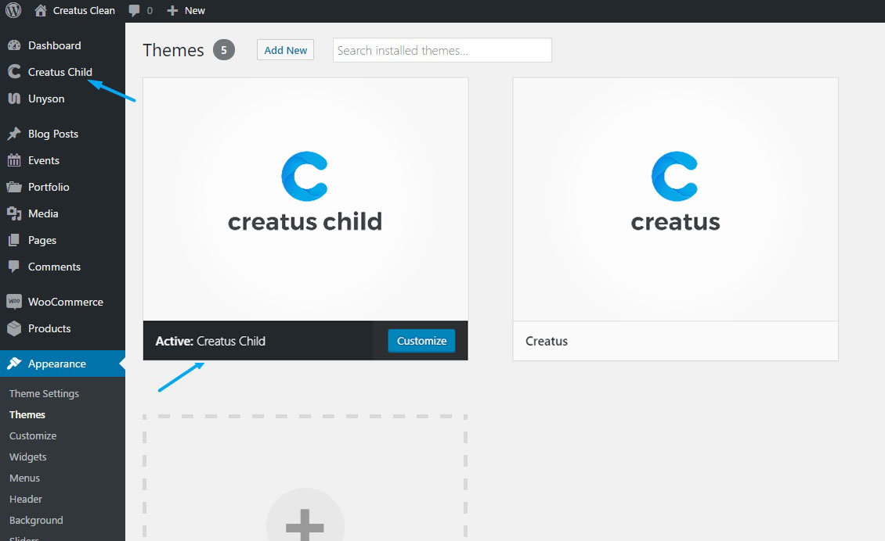
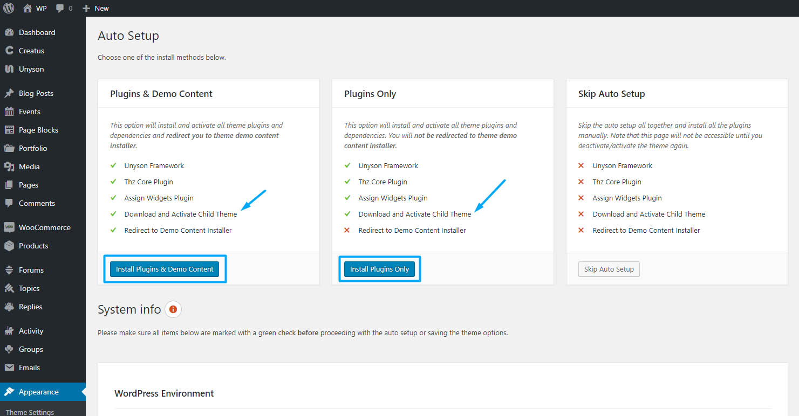

Once you [__install__]( http://themezly.com/how-to-install-creatus-wordpress-theme/ ) and__activate__Creatus WordPress Theme you are taken to the__Auto Setup__screen that gives you two auto setup options that automatically__download__and__activate__Creatus Child Theme.  

- Plugins & Demo Content &nbsp;-&nbsp; __installs all required plugins and dependencies and redirects to demo content install screen__
- Plugins Only  &nbsp;-&nbsp;__installs all required plugins and dependencies__

Clicking on any of the two options will auto install and activate Creatus child theme for you. __We strongly recommend to use child-theme__to make sure that your custom changes will still be effective after the theme has been updated. 
  
### Why use child theme?

WordPress child theme inherits all features and functionalities from a parent theme. This way you can  modify or extend parent theme without changing it and any future theme updates are not going to remove your custom theme modifications. 

Beside being able to extend the theme files, with Creatus you can also extend or modify the parent theme framework theme options, shortcodes ( elements ), extensions or widgets;

### Extend Creatus theme options
If theme options set is located in Creatus framework theme options folder, the__Creatus child theme__is able to override the options set files by copying the file in to child theme corresponding folder;

	├─creatus/
	│ ├─inc/
	│ └──thzframework/
	│     └─theme/
	│       └─options/
	│         ├─posts/
	│         └──post_media.php
	│   
	└─creatus-child/
	  ├─inc/
	  └──thzframework/
	      └─theme/
	        └─options/
	          ├─posts/
	          └──post_media.php

### Extend Creatus shortcodes ( elements ) 
If a shortcode is located in Creatus framework extensions shortcodes folder, the__Creatus child theme__is able to override the shortcode files by copying them in to child theme corresponding folder;

	├─creatus/
	│ ├─inc/
	│ └──thzframework/
	│     └─extensions/
	│       └─shortcodes/
	│         ├─shortcodes/
	│         ├──text/
	│         └───...
	│   
	└─creatus-child/
	  ├─inc/
	  └──thzframework/
	      └─extensions/
	        └─shortcodes/
	          ├─shortcodes/
	          ├──text/
	          └───...
			  
### Extend Creatus extensions
If an extension is located in Creatus framework extensions folder, the__Creatus child theme__is able to override the extension files by copying them in to child theme corresponding folder;

	├─creatus/
	│ ├─inc/
	│ └──thzframework/
	│     └─extensions/
	│       └─megamenu/
	│         ├─views/
	│         └──item-link.php
	│   
	└─creatus-child/
	  ├─inc/
	  └──thzframework/
	      └─extensions/
	        └─megamenu/
	          ├─views/
	          └──item-link.php

### Extend Creatus widgets		  
If a widget is located in Creatus inc widgets folder, the__Creatus child theme__is able to override the__widget.php__file by copying it to child theme corresponding folder;

	├─creatus/
	│ ├─inc/
	│ └──widgets/
	│     └─thz-flickr/
	│       └─views/
	│         └──widget.php
	│   
	└─creatus-child/
	  ├─inc/
	  └──widgets/
	      └─thz-flickr/
	        └─views/
	          └──widget.php
			  
			  

	<h3 class="thz-notification-title">Info</h3>
	

For more information about Unyson [__extensions__](http://manual.unyson.io/en/latest/extensions/introduction.html#child-extensions) and [__shortcodes__](http://manual.unyson.io/en/latest/extension/shortcodes/index.html#overwriting-shortcodes) extend please visit [__Unyson Theme Framework manual__](http://manual.unyson.io).
	

			  

