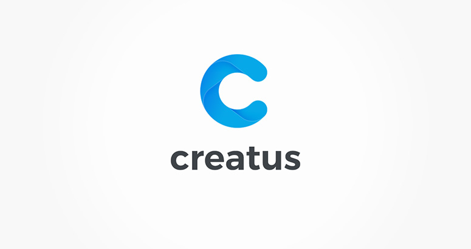

Creatus theme options are separated in to corresponding options files and are located in `creatus/inc/thzframework/options` folder. Each of these files can be changed or extended. 

If theme options set file is located in Creatus framework theme options folder, the __Creatus child theme__ is able to override the options set files by copying the file in to __creatus-child__ theme corresponding folder;

	├─creatus/
	│ ├─inc/
	│ └──thzframework/
	│     └─theme/
	│       └─options/
	│         ├─posts/
	│         └──post_media.php
	│   
	└─creatus-child/
	  ├─inc/
	  └──thzframework/
	      └─theme/
	        └─options/
	          ├─posts/
	          └──post_media.php

			  

Once you copy the file over you can make desired changes to theme option file and extend your __creatus-child__ theme options.

	<h3 class="thz-notification-title">Info</h3>
	

	Please note that theme options extend is your responsibility and we offer only limited support fur such tasks.
	

