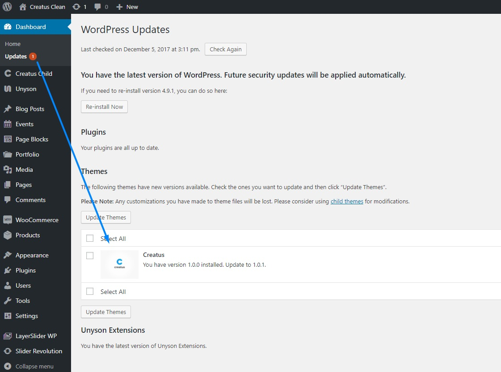

Creatus WordPress Theme is using WordPress update utility to notify you of updates. If you see the update simply select the Creatus theme from themes for update list and click on __Update Themes__ button. After the update theme might notify you if there are any __theme required plugins__ updates. Once you see the notice simply follow the link and update required plugins. If you have any issues with this procedure follow FTP update instructions.

### Update via FTP

To gain access to your server you will need __[FTP](http://en.wikipedia.org/wiki/File_Transfer_Protocol)__ credentials. If you do not have these please contact your hosting provider.

1. Download the new theme version from your member area
2. Login in your WordPress installation root than go to `wp_root/wp-content/themes` folder 
3. Upload the theme zip archive to `wp_root/wp-content/themes` folder 
4. Locate `creatus` folder and delete it
5. Extract the zip archive that you have previously uploaded
6. Delete the zip archive that you have previously uploaded
7. Update theme required plugins once you see the notice to do so