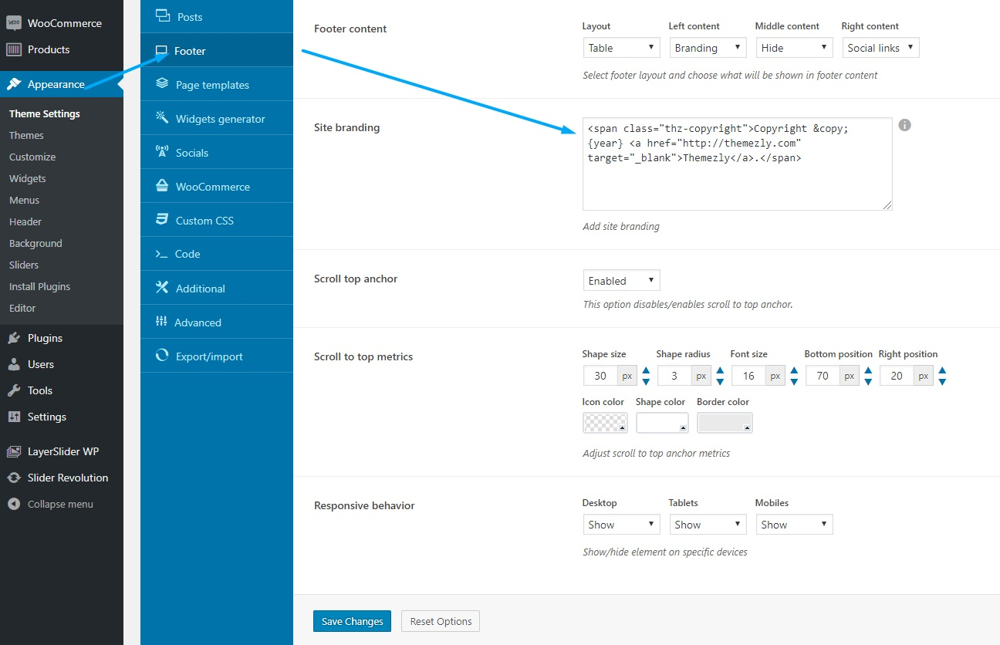

To change footer branding please go to Creatus __theme settings > Footer tab__ and locate option by name __Site branding__.  In this textarea you can __use span, a, div and img html tags__. If you wish to add copyright year please use `{year}` instead of the numbers. This way the current year will always be shown and you will not have to change it the next year.

