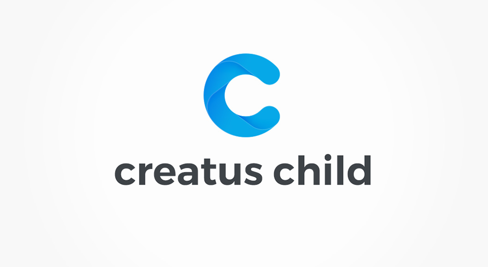

WordPress child theme is a WordPress theme that inherits all functionalities of its parent theme. Child themes should always be used when you need to extend your parent theme and your changes will __not__ be lost once the parent theme has been updated. 

One more advantage of __Creatus child theme__ is the ability to override the options files by copying the __parent (creatus) theme__ file in to __creatus-child__ theme corresponding folder;

	├─creatus/
	│ ├─inc/
	│ └──thzframework/
	│     └─theme/
	│       └─options/
	│         ├─posts/
	│         └──post_media.php
	│   
	└─creatus-child/
	  ├─inc/
	  └──thzframework/
	      └─theme/
	        └─options/
	          ├─posts/
	          └──post_media.php

			  

Once you copy the file over you can make desired changes to theme option file and extend your __creatus-child__ theme options.

	

	Please note that theme options extend is your responsibility and we offer only limited support fur such tasks.
	

