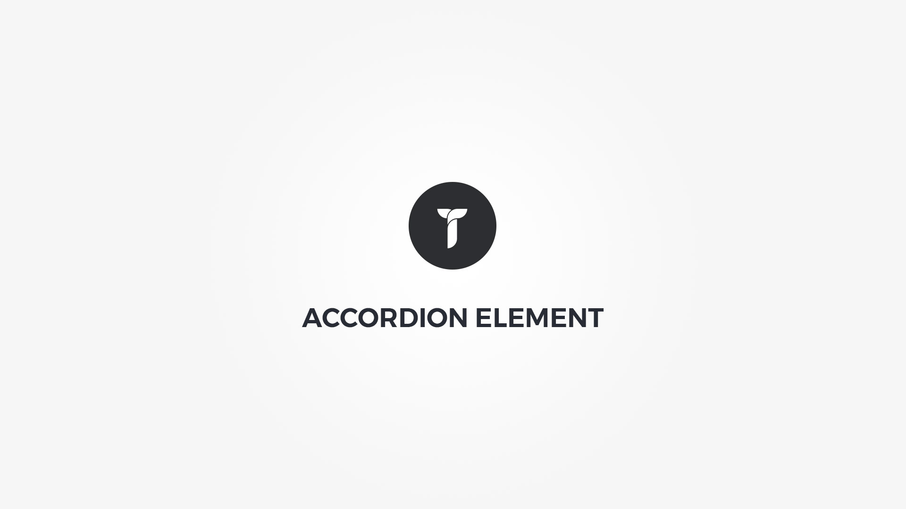

Accordion element will let you display custom content within collapsible container. Element popup contains following options;

#### Defaults tab{.options-tab}
1. __Sorting title__&nbsp;-&nbsp; Used only in builder for easy sorting.
1. __Accordions__&nbsp;-&nbsp; Add/edit your accordions.
1. __Container metrics__&nbsp;-&nbsp; Add custom class or ID to HTML container and adjust visibility on specific devices.

#### Layout tab{.options-tab}
1. __Container box style__&nbsp;-&nbsp; Adjust .thz-shortcode-accordion box style.
1. __Global metrics__&nbsp;-&nbsp; Adjust borders, borders width, space between accordions, toggle arrow, and first accordion open/closed on page load.
1. __Title padding__&nbsp;-&nbsp; Adjust .thz-accordion-title padding.
1. __Content padding__&nbsp;-&nbsp; Adjust .thz-accordion-content padding

#### Styling tab{.options-tab}
1. __Title font__&nbsp;-&nbsp; Accordion title font metrics
1. __Active title colors__&nbsp;-&nbsp; Set active accordion title colors
1. __Inactive title colors__&nbsp;-&nbsp; Set inactive accordion title colors
1. __Global colors__&nbsp;-&nbsp; Set borders colors, content background, link, links hovered and headings colors. Theme defaults are used if empty.
