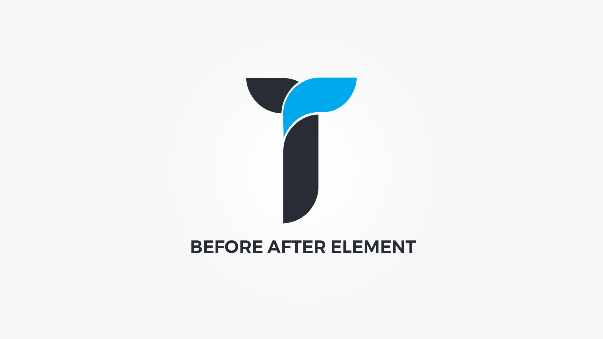

Before After element highlights differences between two images. Element popup contains following options;

#### Images tab{.options-tab}
1. __ Before image __ &nbsp;-&nbsp; Select before image.
1. __ After image __ &nbsp;-&nbsp; Select after image.

#### Settings tab{.options-tab}
1. __ Compare metrics __ &nbsp;-&nbsp; Set script metrics and handle colors. See help for more info.
1. __ Images size __ &nbsp;-&nbsp; Select the images size to be used.
1. __ Container box style __ &nbsp;-&nbsp; Adjust .thz-before-after-container box style.
1. __ Container metrics __ &nbsp;-&nbsp; Add custom class or ID to HTML container and adjust visibility on specific devices.

#### Effects tab{.options-tab}
1. __ Animate container __ &nbsp;-&nbsp; Add animation to the HTML container.
1. __ Container parallax __ &nbsp;-&nbsp; Activate/deactivate container parallax.