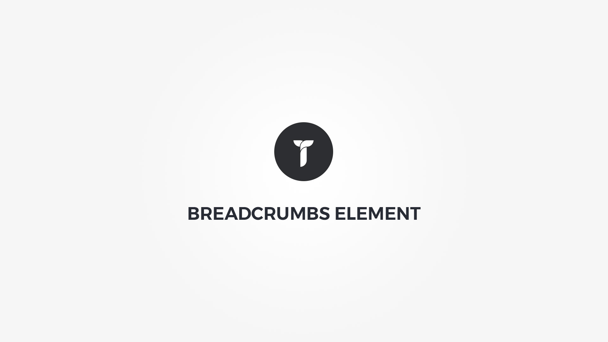

Breadcrumbs element displays the path from homepage to current page. Element popup contains following options;

#### Defaults tab{.options-tab}
1. __ Breadcrumbs font __ &nbsp;-&nbsp; Adjust breadcrumbs font metrics.
1. __ Breadcrumbs colors __ &nbsp;-&nbsp; Breadcrumbs font colors. If empty, colors are inhereted from theme.
1. __ Breadcrumbs Separator __ &nbsp;-&nbsp; Select separator type and adjust space between separator and breadcrumbs

#### Layout tab{.options-tab}
1. __ Container box style __ &nbsp;-&nbsp; Adjust .thz-breadcrumbs box style.
1. __ Links holder box style __ &nbsp;-&nbsp; Adjust .thz-breadcrumbs-links box style.
1. __ Container metrics __ &nbsp;-&nbsp; Add custom class or ID to HTML container and adjust visibility on specific devices.

#### Effects tab{.options-tab}
1. __ Animate __ &nbsp;-&nbsp; Add animation to the HTML container.
1. __ Container parallax __ &nbsp;-&nbsp; Activate/deactivate container parallax.