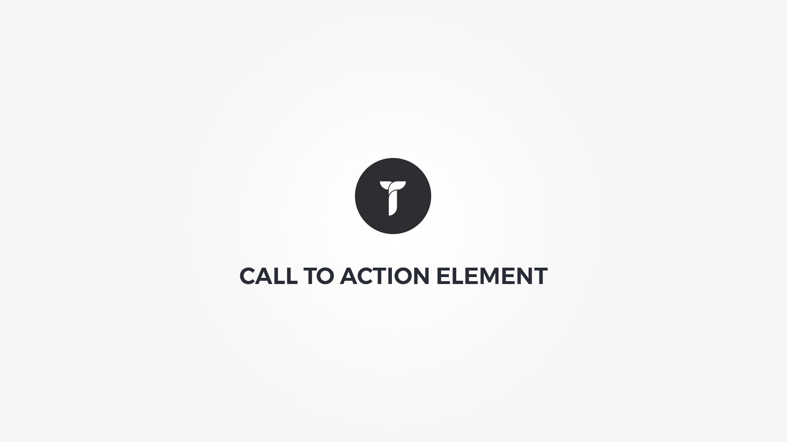

Call To Action element will help you display custom content intended to induce visitors attention. Element popup contains following options;

#### General tab{.options-tab}
1. __ Cta holder box style __ &nbsp;-&nbsp; Adjust .thz-cta-box-holder box style.
1. __ Cta box style __ &nbsp;-&nbsp; Adjust .thz-cta-box box style.
1. __ Animate __ &nbsp;-&nbsp; Add animation to the HTML container.
1. __ Container metrics __ &nbsp;-&nbsp; Add custom class or ID to HTML container and adjust visibility on specific devices.

#### Text tab{.options-tab}
1. __ Heading __ &nbsp;-&nbsp; Add heading text.
1. __ Sub heading __ &nbsp;-&nbsp; Add sub heading text.
1. __ Text __ &nbsp;-&nbsp; Call to action text.

#### Button 1 tab{.options-tab}
1. __ Show button 1 __ &nbsp;-&nbsp; Show or hide cta buton 1
1. __ Button __ &nbsp;-&nbsp; Button generator.

#### Button 2 tab{.options-tab}
1. __ Show button 2 __ &nbsp;-&nbsp; Show or hide cta buton 2
1. __ Button __ &nbsp;-&nbsp; Button generator.

#### Icon tab{.options-tab}
1. __ Icon __ &nbsp;-&nbsp; Add icon to cta.
1. __ Icon size __ &nbsp;-&nbsp; Set cta icon size.
1. __ Background shape __ &nbsp;-&nbsp; Hide/show icon bacground shape.

#### Layout tab{.options-tab}
1. __ Elements settings __ &nbsp;-&nbsp; Set text alignment, button and icon position and vertical alignment.
1. __ Spacers __ &nbsp;-&nbsp; This is the space between the element and the surrounding elements.
1. __ Heading padding __ &nbsp;-&nbsp; Set heading padding.
1. __ Sub heading padding __ &nbsp;-&nbsp; Set sub heading padding.
1. __ Text padding __ &nbsp;-&nbsp; Set text heading padding.
1. __ Set text heading padding. __ &nbsp;-&nbsp; Set buttons container padding.
1. __ Icon padding __ &nbsp;-&nbsp; Set icon container padding.

#### Colors tab{.options-tab}
1. __ Heading color __ &nbsp;-&nbsp; Set heading color.
1. __ Sub heading color __ &nbsp;-&nbsp; Set Sub heading color.
1. __ Text color __ &nbsp;-&nbsp; Set text color.
1. __ Icon color __ &nbsp;-&nbsp; Set icon color.

#### Typography tab{.options-tab}
1. __ Heading font __ &nbsp;-&nbsp; Set custom font settings for heading.
1. __ Sub heading font __ &nbsp;-&nbsp; Set custom font settings for sub heading.
1. __ Text font __ &nbsp;-&nbsp; Set custom font settings for cta text.