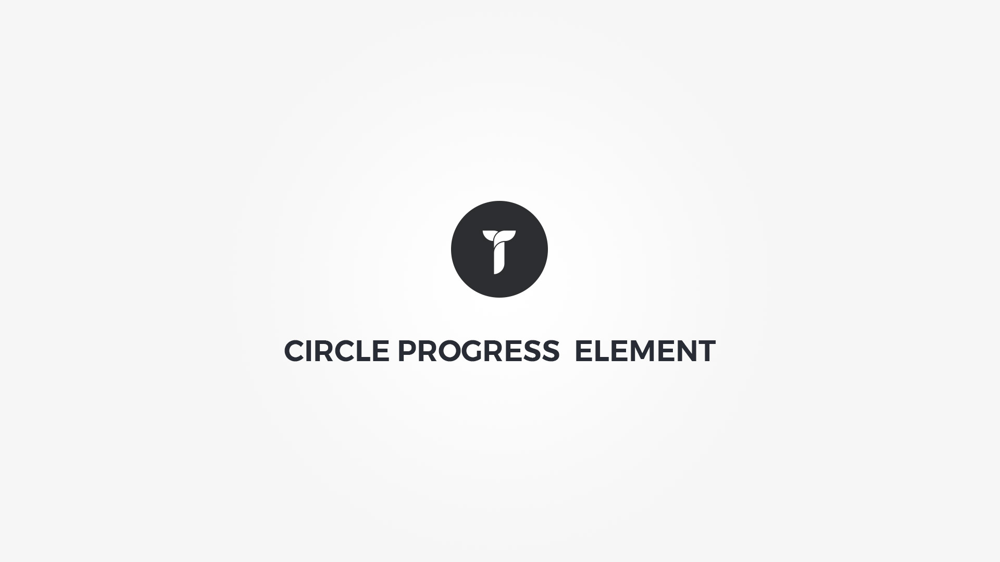

Circle Progress element will draw an animated circular bar around the text. Element popup contains following options;

#### Defaults tab{.options-tab}
1. __ Holder box style __ &nbsp;-&nbsp; Adjust .thz-circle-progress-holder box style.
1. __ Progress __ &nbsp;-&nbsp; Setup your progress bar size and animation.
1. __ Container metrics __ &nbsp;-&nbsp; Add custom class or ID to HTML container and adjust visibility on specific devices.

#### Progress tab{.options-tab}
1. __ Progress bar colors __ &nbsp;-&nbsp; Setup your progress bar colors. If multiple fill colors, bar fill becomes a gradient.
1. __ Progress value __ &nbsp;-&nbsp; Choose progress circle value. Percent or custom defined text/icon.

#### Outer circle tab{.options-tab}
1. __ Background __ &nbsp;-&nbsp; Adjust .thz-circle-progress background.
1. __ Metrics __ &nbsp;-&nbsp; Adjust outer circle metrics.

#### Inner circle tab{.options-tab}
1. __ Background __ &nbsp;-&nbsp; Adjust .thz-circle-progress-inner background.
1. __ Border __ &nbsp;-&nbsp; Adjust inner circle border.

#### Title tab{.options-tab}
1. __ Title __ &nbsp;-&nbsp; Add progress title.
1. __ Title style __ &nbsp;-&nbsp; Adjust title look and feel.
1. __ Title separator __ &nbsp;-&nbsp; Adjust title separator. Separator is located between title and text.

#### Text tab{.options-tab}
1. __ Text __ &nbsp;-&nbsp; Add progress text.	
1. __ Text style __ &nbsp;-&nbsp; Adjust text look and feel.

#### Effects tab{.options-tab}
1. __ Animate __ &nbsp;-&nbsp; Add animation to the HTML container.

