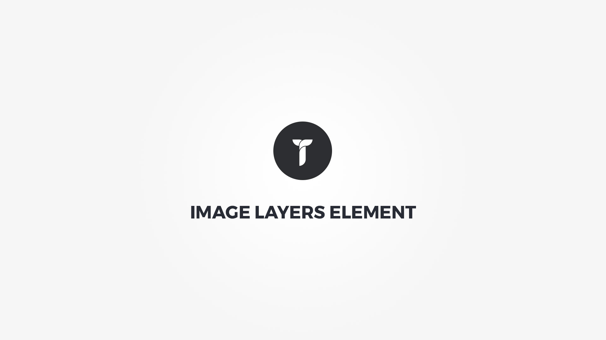

Image Layers element can stack multiple image layers on top of each other inside a cusomizable container. Element popup contains following options;

#### Layers tab{.options-tab}
1. __ Layers area __ &nbsp;-&nbsp; Click on select to change container ratio. Click on "Add image layer" to add new layer. Hover over the layer to see controls.

#### Settings tab{.options-tab}
1. __ Layers container box style __ &nbsp;-&nbsp; Adjust .thz-image-layers box style.
1. __ Container box style __ &nbsp;-&nbsp; Adjust .thz-image-layers-container box style.
1. __ Container metrics __ &nbsp;-&nbsp; Add custom class or ID to HTML container and adjust visibility on specific devices.

#### Lightbox tab{.options-tab}
1. __ Backdrop Style __ &nbsp;-&nbsp; Select backdrop ( popup background ) style.
1. __ Backdrop Opacity __ &nbsp;-&nbsp; Set backdrop ( popup background ) opacity.
1. __ Popup effect __ &nbsp;-&nbsp; Select popup window opening effect.
1. __ Show thumbnails slider __ &nbsp;-&nbsp; Show/hide lightbox thumbnails slider.

#### Overlay tab{.options-tab}
1. __ Overlay display mode __ &nbsp;-&nbsp; Select overlay display mode.
1. __ Image overlay background __ &nbsp;-&nbsp; Set layer overlay background.
1. __ Image overlay effect __ &nbsp;-&nbsp; Select layer overlay hover effect and duration.
1. __ Image effect __ &nbsp;-&nbsp; Select layer image hover effect and duration.
1. __ Overlay icon effect __ &nbsp;-&nbsp; Select layer overlay icon hover effect and duration.
1. __ Image overlay distance __ &nbsp;-&nbsp; Distance the layer overlay from layer box edges.

#### Overlay icon tab{.options-tab}
1. __ Show overlay icon __ &nbsp;-&nbsp; Show/hide overlay icon.
1. __ Overlay icon __ &nbsp;-&nbsp; Set overlay icon. Shown only if icon selected.
1. __ Icon metrics __ &nbsp;-&nbsp; Adjust icon metrics.
1. __ Shape metrics __ &nbsp;-&nbsp; Adjust icon background shape metrics.

#### Effects tab{.options-tab}
1. __ Animate container __ &nbsp;-&nbsp; Add animation to the layers HTML container.
1. __ Container parallax __ &nbsp;-&nbsp; Activate/deactivate container parallax.
1. __ Media parallax __ &nbsp;-&nbsp; Activate/deactivate media parallax. This effect works for images only and it does NOT work if media height is auto! To parallax media for specific items only, add specific items in the order that you see them separated by comma like; 1,5,7. This would parallax media for 1st 5th and 7th item.

#### Layer Defaults tab{.options-tab}
1. __ Select Image __ &nbsp;-&nbsp; Select or upload an image.
1. __ Image metrics __ &nbsp;-&nbsp; Adjust layer image size , position and grayscale filter.
1. __ Layer box style __ &nbsp;-&nbsp; Adjust .thz-img-layer box style
1. __ Container metrics __ &nbsp;-&nbsp; Add custom class or ID to HTML container and adjust visibility on specific devices.
1. __ Inherit style from __ &nbsp;-&nbsp; Insert layer ID to inherit the style from. If you have multiple layers with same box style you can set main layer Custom ID than add that ID here. This way ever layer on this page with this inherit ID will use same box style. This reduces the overhead CSS and renders the layers faster. Note that once the inherit ID is added the box style for this layer is not printed. The effects must be set on per layer basis.

#### Layer Actions tab{.options-tab}
1. __ Click action __ &nbsp;-&nbsp; Select image click action. Open a link or the image in lightbox.

#### Layer Effects tab{.options-tab}
1. __ Animate container __ &nbsp;-&nbsp; Add animation to the layer HTML container.
1. __ Container parallax __ &nbsp;-&nbsp; Activate/deactivate container parallax.

