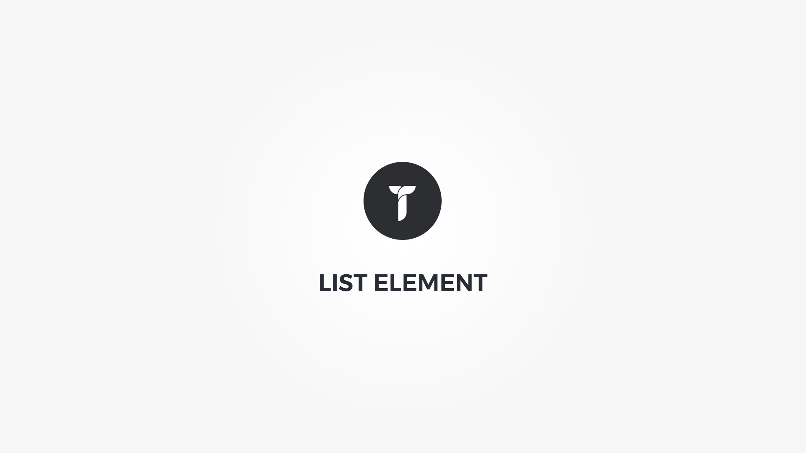

List element will displays a list of items within ordered, unordered or icon html list. Element popup contains following options;

#### Defaults tab{.options-tab}
1. __ List Type __ &nbsp;-&nbsp; Select list type. Default, ordered, unstyle or icon.
1. __ List items __ &nbsp;-&nbsp; Create your list items.

#### Item popup tab{.options-tab}
1. __ Title __ &nbsp;-&nbsp; Something
1. __ Item title __ &nbsp;-&nbsp; Set item title.
1. __ Item Icon __ &nbsp;-&nbsp; Add item icon. This icon overrides List type "Icon list" icon.
1. __ Add link __ &nbsp;-&nbsp; Add link for this item.
1. __ Sub items __ &nbsp;-&nbsp; Create sub items.

#### Style tab{.options-tab}
1. __ Items font __ &nbsp;-&nbsp; Items font metrics.
1. __ List box style __ &nbsp;-&nbsp; Adjust .thz-shortcode-list box style.
1. __ Items box style __ &nbsp;-&nbsp; Adjust .thz-list-item box style.
1. __ Sub list box style __ &nbsp;-&nbsp; Adjust .thz-list-item .sub-list box style.
1. __ List items metrics __ &nbsp;-&nbsp; Reset item margin/padding or set items links colors.
1. __ Container metrics __ &nbsp;-&nbsp; Add custom class or ID to HTML container and adjust visibility on specific devices.