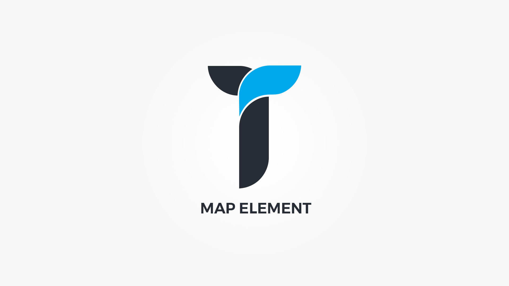

Map element displays customizable Google Maps within a adjustable container. Element popup contains following options;

#### Defaults tab{.options-tab}
1. __ Population Method __ &nbsp;-&nbsp; Select map population method. Events or custom.
1. __ Locations __ &nbsp;-&nbsp; Add map locations.
1. __ Map Type __ &nbsp;-&nbsp; Select map type.
1. __ Map Height __ &nbsp;-&nbsp; Set map height.
1. __ Container metrics __ &nbsp;-&nbsp; Add custom class or ID to HTML container and adjust visibility on specific devices.

#### Style tab{.options-tab}
1. __ Map zoom __ &nbsp;-&nbsp; Set map zoom.
1. __ Map box style __ &nbsp;-&nbsp; Adjust .thz-map box style.
1. __ Map pin image __ &nbsp;-&nbsp; Upload a pin for your location(s) (64x64).
1. __ Map style __ &nbsp;-&nbsp; Copy/Paste map styles from __[Snazzymaps](https://snazzymaps.com/)__.

#### Map controlls tab{.options-tab}
1. __ Zoom __ &nbsp;-&nbsp;  Show/hide map zoom control.
1. __ Street view __ &nbsp;-&nbsp; Show/hide map street view control.
1. __ Pan __ &nbsp;-&nbsp; Show/hide map pan control.
1. __ Map type __ &nbsp;-&nbsp; Show/hide map type control.

#### Typography tab{.options-tab}
1. __ Location Title __ &nbsp;-&nbsp; Location title font color family and metrics.
1. __ Location Description __ &nbsp;-&nbsp; Location description font color family and metrics.

#### Effects tab{.options-tab}
1. __ Animate __ &nbsp;-&nbsp; Add animation to the HTML container.