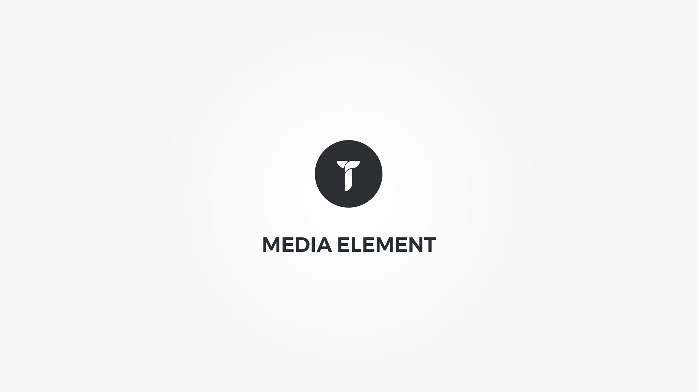

Media element displays Vimeo video, Youtube video, Self hosted video or audio, HTML5 video or audio, iframe or embed within customizable container. Element popup contains following options;

#### Layout tab{.options-tab}
1. __ Holder box style __ &nbsp;-&nbsp; Adjust .thz-media-item-container box style.
1. __ Media box style __ &nbsp;-&nbsp; Adjust .thz-media-item-media box style.
1. __ Container metrics __ &nbsp;-&nbsp; Add custom class or ID to HTML container and adjust visibility on specific devices.

#### Media box tab{.options-tab}
1. __ Media poster __ &nbsp;-&nbsp; Activate media poster. See help for more info. If this option is inactive, media loads on pageload and increases page load time. This option adds a preview poster which than activates the media on click.
1. __ Image size __ &nbsp;-&nbsp; Select the poster image size.
1. __ Poster grayscale __ &nbsp;-&nbsp; Add grayscale effect to media poster.
1. __ Media container height __ &nbsp;-&nbsp; Set media container height.
1. __ Animate media __ &nbsp;-&nbsp; Add animation to the media HTML container.

#### Media tab{.options-tab}
1. __ Media Type __ &nbsp;-&nbsp; Select media type.
1. __ Poster image __ &nbsp;-&nbsp; Insert a poster image for this media.

#### Media overlay tab{.options-tab}
1. __ Overlay display mode __ &nbsp;-&nbsp; Select overlay display mode.
1. __ Media overlay effect __ &nbsp;-&nbsp; Select media overlay hover effect and duration.
1. __ Media overlay background __ &nbsp;-&nbsp; Set media overlay background.
1. __ Media image effect __ &nbsp;-&nbsp; Select media image hover effect and duration.
1. __ Media overlay distance __ &nbsp;-&nbsp; Distance the media overlay from media box edges.
1. __ Overlay icon metrics __ &nbsp;-&nbsp; Adjust overlay icon metrics.