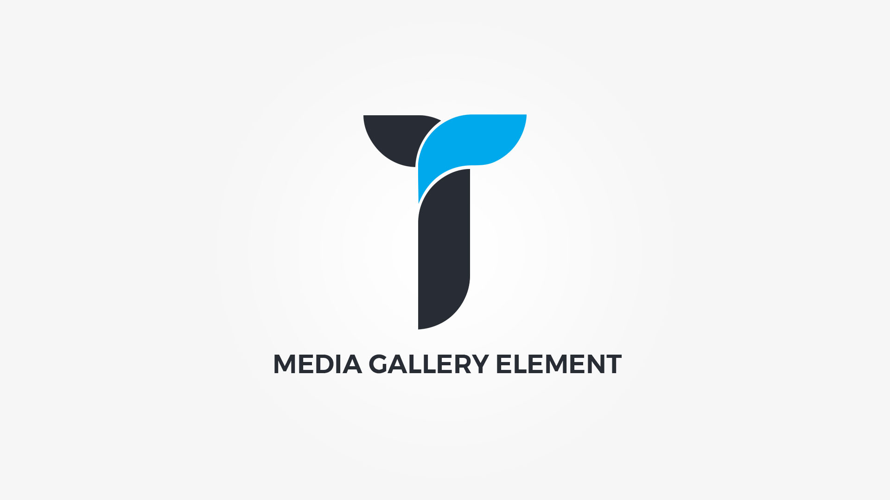

Media Gallery element displays Images, Vimeo video, Youtube video, Self hosted video or audio, HTML5 video or audio, iframe or embed within grid or slider. Element popup contains following options;

#### Layout tab{.options-tab}
1. __ Holder box style __ &nbsp;-&nbsp; Adjust .thz-media-holder box style.
1. __ Media layout __ &nbsp;-&nbsp; Select media layout mode.
1. __ Media grid settings __ &nbsp;-&nbsp; Adjust grid settings. If the .thz-grid-item-in width is less than desired min width, the columns number drops down by one in order to honor the min width setting. This adjustment is active only if media container height is anything else but metro. On the other hand if the window width is below 980px and grid has more than 2 columns, only 2 columns are shown. Under 767px 1 column is shown.
1. __ Media slider layout __ &nbsp;-&nbsp; Adjust media slider layout.
1. __ Media slider animation __ &nbsp;-&nbsp; Adjust media slider animation.
1. __ Container metrics __ &nbsp;-&nbsp; Add custom class or ID to HTML container and adjust visibility on specific devices.

#### Media box tab{.options-tab}
1. __ Media posters __ &nbsp;-&nbsp; Activate media posters for all media types except images. f this option is inactive, all videos and iframes load on pageload and increase page load time. This option adds a preview poster which than activates the media on click.
1. __ Media grayscale __ &nbsp;-&nbsp; Add grayscale effect to media images.
1. __ Media box style __ &nbsp;-&nbsp; Adjust .thz-media-item-media box style.
1. __ Image size __ &nbsp;-&nbsp; Select the image size to be used in gallery.
1. __ Media container height __ &nbsp;-&nbsp; Set media container height.

#### Media tab{.options-tab}
1. __ Media items __ &nbsp;-&nbsp; Add/edit media items. Drag and drop to reorder.
1. __ Show title __ &nbsp;-&nbsp; Show/hide media title.

#### Media Title tab{.options-tab}
1. __ Title margin __ &nbsp;-&nbsp; Adjust title margin.
1. __ Title font __ &nbsp;-&nbsp; Adjust item title font.

#### Lightbox tab{.options-tab}
1. __ Backdrop Style __ &nbsp;-&nbsp; Select backdrop ( popup background ) style.
1. __ Backdrop Opacity __ &nbsp;-&nbsp; Set backdrop ( popup background ) opacity.
1. __ Popup effect __ &nbsp;-&nbsp; Select popup window opening effect.
1. __ Show thumbnails slider __ &nbsp;-&nbsp; Show/hide lightbox thumbnails slider.

#### Media Overlay tab{.options-tab}
1. __ Overlay display mode __ &nbsp;-&nbsp; Select overlay display mode.
1. __ Media overlay background __ &nbsp;-&nbsp; Set media overlay background.
1. __ Media overlay effect __ &nbsp;-&nbsp; Select media overlay hover effect and duration.
1. __ Media image effect __ &nbsp;-&nbsp; Select media image hover effect and duration.
1. __ Overlay element effect __ &nbsp;-&nbsp; Select media overlay element hover effect and duration.
1. __ Media overlay distance __ &nbsp;-&nbsp; Distance the media overlay from media box edges.

#### Overlay icon tab{.options-tab}
1. __ Show overlay icon __ &nbsp;-&nbsp; Show/hide overlay icon.
1. __ Icon metrics __ &nbsp;-&nbsp; Adjust icon metrics.
1. __ Shape metrics __ &nbsp;-&nbsp; Adjust icon background shape metrics.

#### Filter tab{.options-tab}
1. __ Show filter __ &nbsp;-&nbsp; Show/hide sorting filter.
1. __ Filter margin __ &nbsp;-&nbsp; Adjust filter margin.
1. __ Filter link metrics __ &nbsp;-&nbsp; Adjust filter link metrics.
1. __ Filter link style __ &nbsp;-&nbsp; Adjust filter links style. Hovered link takes properties from active link.
1. __ Filter font __ &nbsp;-&nbsp; Filter links font metrics.