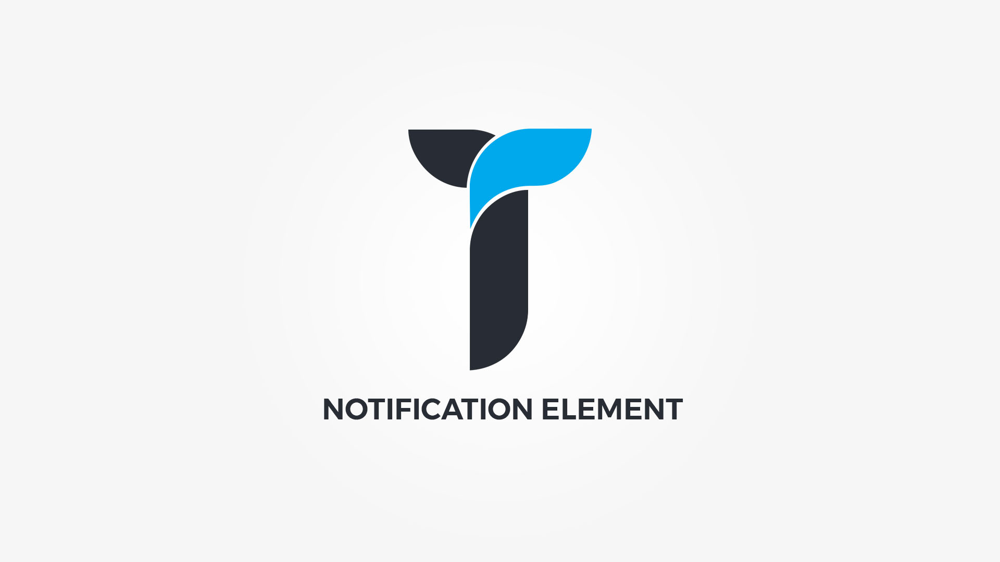

Notification element displays stylish customized message to your website vistiors. Element popup contains following options;

#### General tab{.options-tab}
1. __ Show close button? __ &nbsp;-&nbsp; Show/hide the close button.
1. __ Animate __ &nbsp;-&nbsp; Add animation to the HTML container.
1. __ Container metrics __ &nbsp;-&nbsp; Add custom class or ID to HTML container and adjust visibility on specific devices.

#### Notification tab{.options-tab}
1. __ Notification metrics __ &nbsp;-&nbsp; Set notification title, tag and alignment.
1. __ Notification icon metrics __ &nbsp;-&nbsp; Set notification icon, icon size and vrtical alignment.
1. __ Text __ &nbsp;-&nbsp; Notification text.

#### Styling tab{.options-tab}
1. __ Notification style type __ &nbsp;-&nbsp; Select notification style type.
1. __ Notification style __ &nbsp;-&nbsp; Select notification style.
1. __ Notification box style __ &nbsp;-&nbsp; Adjust .thz-notification box style.
1. __ Notification colors __ &nbsp;-&nbsp; Set notification colors. __Accent__: This is color for notification title, icon and close button. __Tex__t: This is notification text color. __Link__: Set default color for notification links. __Link hovered__: Set hovered link color.