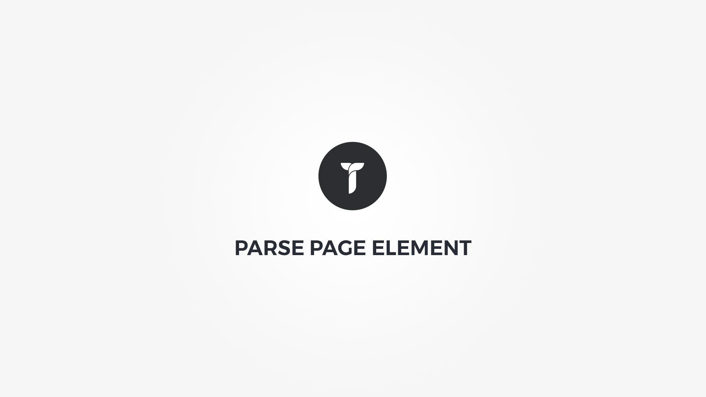

Parse Page element will parse external or internal page content, cache it's contents and display it within customizable container. Element popup contains following options;

1. __Page url__&nbsp;-&nbsp; Insert url of the page you need parsed.
1. __Cache days__&nbsp;-&nbsp; Set default days cache time. Note that on post update cache is cleared.
1. __Cache hours__&nbsp;-&nbsp; Set default hours cache time. 0.5 = 30 minutes. Note that on post update cache is cleared.
1. __Markdown language__&nbsp;-&nbsp; Adjust markdown language parsing. Useful if serving pages that use markup language.
1. __Container box style__&nbsp;-&nbsp; Adjust .thz-parsed-page-content box style.
1. __Container metrics__&nbsp;-&nbsp; Add custom class or ID to HTML container and adjust visibility on specific devices.
