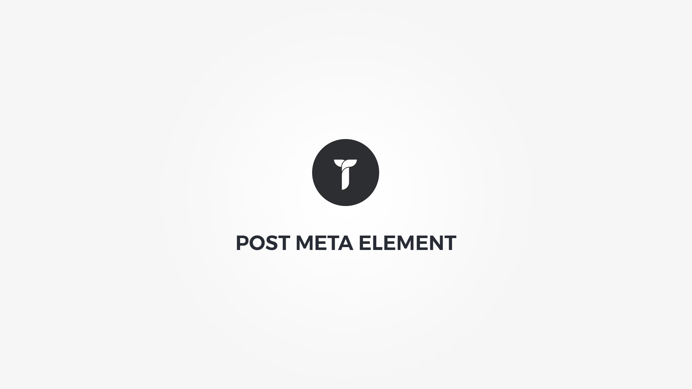

	

Post meta element displays the single post meta. Meta elements can be date, views, author, categories, tags, comments count or likes.

#### Defaults tab{.options-tab}
1. __ Meta elements __ &nbsp;-&nbsp; Check to show/hide specific post meta elements. Click and drag the label to sort.
1. __ Meta preferences __ &nbsp;-&nbsp; Adjust meta preferences.
1. __ Meta separator __ &nbsp;-&nbsp; Select post meta elements separator. This option will let you adjust space between separator and elements. Nudge option can help you align the separator verticaly. This can come in handy if separator is icon and icon font does not place the icon in absolute vertical middle. Nudge moves relative top position of the separator.
1. __ Font settings __ &nbsp;-&nbsp; Adjust meta elements fonts.
1. __ Meta colors __ &nbsp;-&nbsp; Adjust meta elements colors.

#### Layout tab{.options-tab}
1. __ Container box style __ &nbsp;-&nbsp; Adjust .thz-post-meta-sh box style.
1. __ Meta box style __ &nbsp;-&nbsp; Adjust Adjust .thz-post-meta-sh-holder box style.
1. __ Container metrics __ &nbsp;-&nbsp; Add custom class or ID to HTML container and adjust visibility on specific devices.

#### Effects tab{.options-tab}
1. __ Animate __ &nbsp;-&nbsp; Add animation to the HTML container.
1. __ Container parallax __ &nbsp;-&nbsp; Activate/deactivate container parallax.