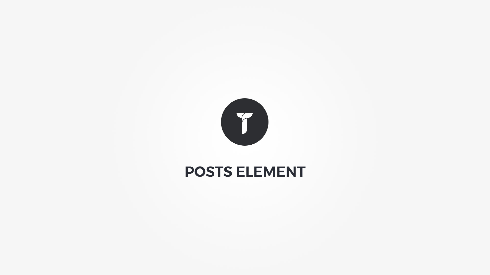

Posts element displays loop of post items as a grid, timeline or a slider. Element popup contains following options;

#### Query tab{.options-tab}
1. __ Post types __ &nbsp;-&nbsp; Select post types. If none is selected WordPress default post type is used.
1. __ Query metrics __ &nbsp;-&nbsp; Select number of posts and set their order. Items -1 = all.
1. __ Specific categories __ &nbsp;-&nbsp; Show posts from specific categories.
1. __ Specific tags __ &nbsp;-&nbsp; Show posts containing specific tags.
1. __ Specific author __ &nbsp;-&nbsp; Show posts by specific authors.
1. __ Specific posts __ &nbsp;-&nbsp; Show specific posts.
1. __ Exclude posts __ &nbsp;-&nbsp; Exclude specific posts. 

#### Layout tab{.options-tab}
1. __ Container box style __ &nbsp;-&nbsp; Adjust .thz-posts-holder box style.
1. __ Layout mode __ &nbsp;-&nbsp; Select posts layout mode. Choose from grid, slider or timeline layout mode. 
If grid is selected the __Filter__ tab becomes active which will let you adjust the posts sorting filter layout and style.
1. __ Pagination type __ &nbsp;-&nbsp; Select posts pagination type.
1. __ Animate posts __ &nbsp;-&nbsp; Add animation to the post HTML container.
1. __ Container metrics __ &nbsp;-&nbsp; Add custom class or ID to HTML container and adjust visibility on specific devices.

#### Media tab{.options-tab}
1. __ Media container height __ &nbsp;-&nbsp; Set media container height.
1. __ Post Image size __ &nbsp;-&nbsp; Select the image size to be used in posts.
1. __ Post image grayscale __ &nbsp;-&nbsp; Add grayscale effect to media images.
1. __ Posts slider layout __ &nbsp;-&nbsp; Adjust posts media slider layout.
1. __ Posts slider animation __ &nbsp;-&nbsp; Adjust posts slider.

#### Posts, Posts formats and WooPosts tabs{.options-tab}

These tabs contain options that will let you control and style every post element and containers including the various hover and image effects. 
Every setting has detailed description and or helpful instructions to help you adjust the post items the way you need them.  