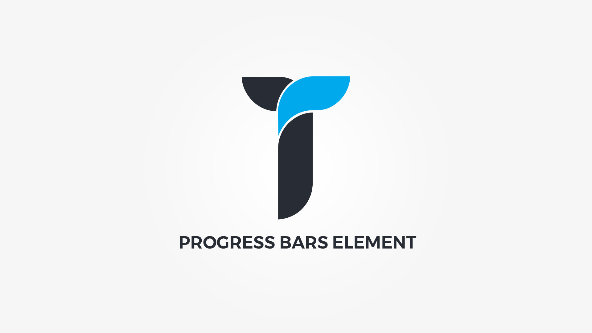

Progress Bars element displays visualized progression of an text defined operation or task. Element popup contains following options;

#### Defaults tab{.options-tab}
1. __ Set title __ &nbsp;-&nbsp; This is progress bars title used in builder only.
1. __ Progress bars __ &nbsp;-&nbsp; Click on the button to add/edit progress bars
1. __ Container metrics __ &nbsp;-&nbsp; Add custom class or ID to HTML container and adjust visibility on specific devices.

#### Add/Edit Progress bar popup{.options-tab}
1. __ Title __ &nbsp;-&nbsp; Set progress title.
1. __ Percentage __ &nbsp;-&nbsp; Set progress bar percentage.
1. __ Duration __ &nbsp;-&nbsp; Set animation duration in milliseconds. 1000ms = 1s.
1. __ Candy bar __ &nbsp;-&nbsp; Adjust progress candy bar.
1. __ Progress holder __ &nbsp;-&nbsp; Adjust .thz-progress-bar box style.
1. __ Progress __ &nbsp;-&nbsp; Adjust .thz-progress-bar-progress box style.
1. __ Title color __ &nbsp;-&nbsp; Set progress title color.
1. __ Percent color __ &nbsp;-&nbsp; Set progress percent color.

#### Style tab{.options-tab}
1. __ Container box style __ &nbsp;-&nbsp; Adjust .thz-progress-bars-set box style.
1. __ Progress bars style __ &nbsp;-&nbsp; Select progress bars style.
1. __ Progress shape type __ &nbsp;-&nbsp; Select progress shape type.
1. __ Shape padding __ &nbsp;-&nbsp; Set shape padding.
1. __ Font settings __ &nbsp;-&nbsp; Adjust title and percent text font size and letter spacing.
1. __ Title text __ &nbsp;-&nbsp; Adjust title text weight, style and transform.
1. __ Percent text __ &nbsp;-&nbsp; Adjust percent text weight and style.