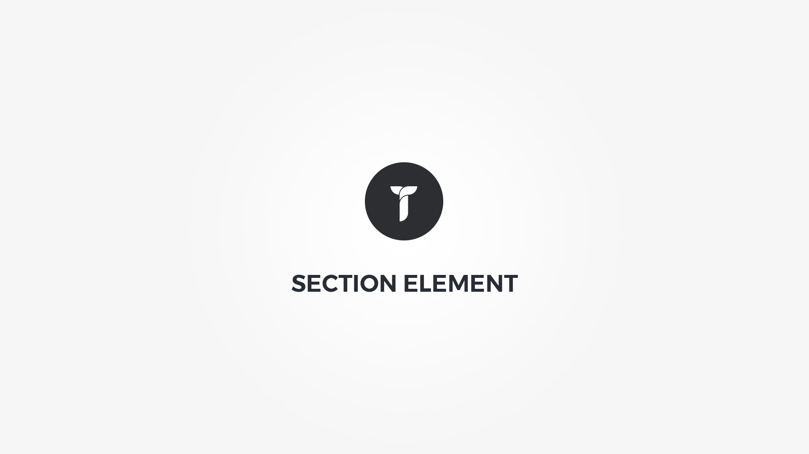

Section element is main layout building block used to separate columns in to rows. Element popup contains following options;

#### Layout tab{.options-tab}
1. __ Section metrics __ &nbsp;-&nbsp; Set section metrics. Section label is used in builder for easy sorting and if you add it to scroll menu it is used in section scroll menu element as tooltip. If you add this section label to scroll menu, __do not forget to add__ Section menu element to the builder. If you select exclude in Full page inclusion option, this section will be displayed as normal section.
1. __ Layout mode __ &nbsp;-&nbsp; Select section layout mode. By default grid layout is created by using left floats for columns, if set to flex or flex equal height grid is using flexbox layout wich gives you additional column flexibility.
1. __ Section box style __ &nbsp;-&nbsp; Adjust .thz-section-holder section box style.
1. __ Section Contained __ &nbsp;-&nbsp; If set to contained this section will be contained by max site width.
1. __ Section spacings __ &nbsp;-&nbsp; Adjust spacings for all containers or columns in this section. This option will help you adjust side space for this section .thz-container or .thz-column. If empty it will use spacings options located in theme options "Site" tab. The section vertical padding can be reset or changed in "Section box style" padding option.
1. __ Use CSS ID as anchor __ &nbsp;-&nbsp; f set to yes the section ID can be used as anchor in your menu. To scroll to this anchor via menu link, create a new menu Custom link with URL #thisID. Do not forget the pound (#) sign in front of the element ID.
1. __ Container metrics __ &nbsp;-&nbsp; Add custom class or ID to HTML container and adjust visibility on specific devices.

#### Typography tab{.options-tab}
1. __ Fonts settings __ &nbsp;-&nbsp; Add custom font settings.
1. __ Links colors __ &nbsp;-&nbsp; Add custom links colors.

#### Effects tab{.options-tab}
1. __ Background layers __ &nbsp;-&nbsp; Create background layer. Add parallax, infinity or basic background layer. This option adds additional background layer to the HTML container. Note that z-index is assigned per layer position in the order. The layer on top has the highest z-index.
1. __ Animation __ &nbsp;-&nbsp; Add animation. This option adds animation effect to the HTML container.
1. __ Content parallax __ &nbsp;-&nbsp; Add content parallax effect. This option adds a parallax effect to the HTML container content.
1. __ Scroll fade __ &nbsp;-&nbsp; Add scroll fade effect. This option adds fade effect on scroll to the HTML container or the container content.
1. __ Full height __ &nbsp;-&nbsp; Add full height effect. This option adds full height ( viewport height ) to the HTML container.
1. __ Separator __ &nbsp;-&nbsp; Add separator. This option adds separator layer to the HTML container.

#### Responsive tab{.options-tab}
1. __Section breakpoints__ &nbsp;-&nbsp; Add custom section settings on specific breakpoints.
1. __Columns breakpoints__ &nbsp;-&nbsp; Add custom settings for all section columns on specific breakpoints.