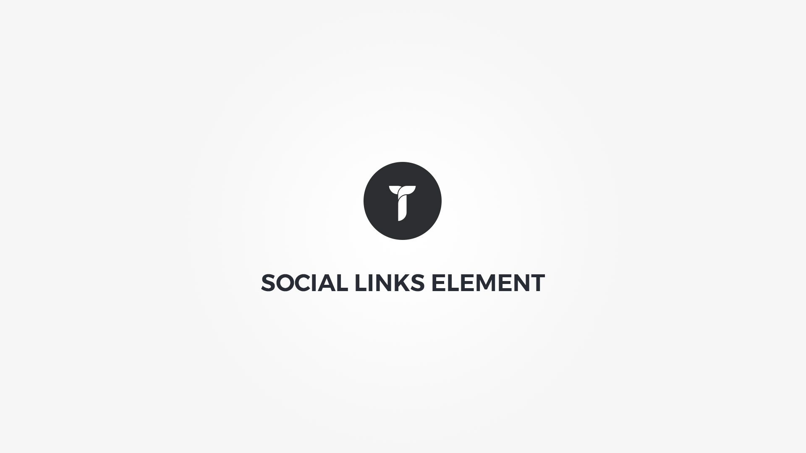

Social Links element display a customizable container with links to your social profiles. Element popup contains following options;

1. __ Social media links __ &nbsp;-&nbsp; Click to add new social media link. Drag and drop to reorder.
1. __ Container box style __ &nbsp;-&nbsp; Adjust .thz-socials-shortcode box style.
1. __ Icons metrics __ &nbsp;-&nbsp; Adjust icons metrics.
1. __ Container metrics __ &nbsp;-&nbsp; Add custom class or ID to HTML container and adjust visibility on specific devices.

#### Social media link popup{.options-tab}

1. __ Website name __ &nbsp;-&nbsp; Social website name.eg:Facebook.
1. __ Social icon __ &nbsp;-&nbsp; Select social icon.
1. __ Social Link __ &nbsp;-&nbsp; Social website link.eg: http://www.facebook.com/themezly.
1. __ Icon colors __ &nbsp;-&nbsp; Set icon colors. Leave empty for default site link color. Style color is used depending on the icon style. If outline, color is used for shape outline border, if flat, color is used as shape background color.
