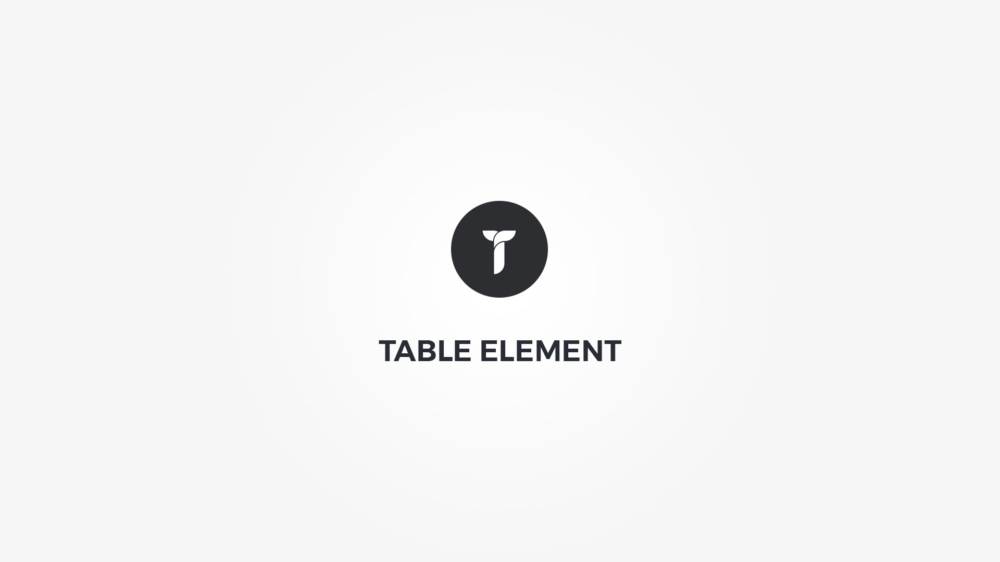

Table element displays list of tabular data or a pricing table. Element popup contains following options;

#### Defaults tab{.options-tab}
1. __ Table Type __ &nbsp;-&nbsp; Choose the table styling options.
1. __ Table editor __ &nbsp;-&nbsp; Visual table editor.

#### Style tab pricing table type{.options-tab}
1. __ Select table style __ &nbsp;-&nbsp; If no style is selected , the tables layout remanis in tact but all styling is removed. This way you can style it yourself.
1. __ Package __ &nbsp;-&nbsp; Customize package style. 
1. __ Heading row __ &nbsp;-&nbsp; Customize heading style.
1. __ Price row __ &nbsp;-&nbsp; Customize price style.
1. __ Miscellaneous colors __ &nbsp;-&nbsp; Customize description row and switch row icon colors.
1. __ Container metrics __ &nbsp;-&nbsp; Add custom class or ID to HTML container and adjust visibility on specific devices.

#### Style tab tabular data type{.options-tab}
1. __ Table Style __ &nbsp;-&nbsp; Select table style.
1. __ Table settings __ &nbsp;-&nbsp; Customize table style.
1. __ Striped rows __ &nbsp;-&nbsp; Show/hide striped rows.
1. __ Container metrics __ &nbsp;-&nbsp; Add custom class or ID to HTML container and adjust visibility on specific devices.

#### Effects tab{.options-tab}
1. __ Animate __ &nbsp;-&nbsp; Add animation to the HTML container.

