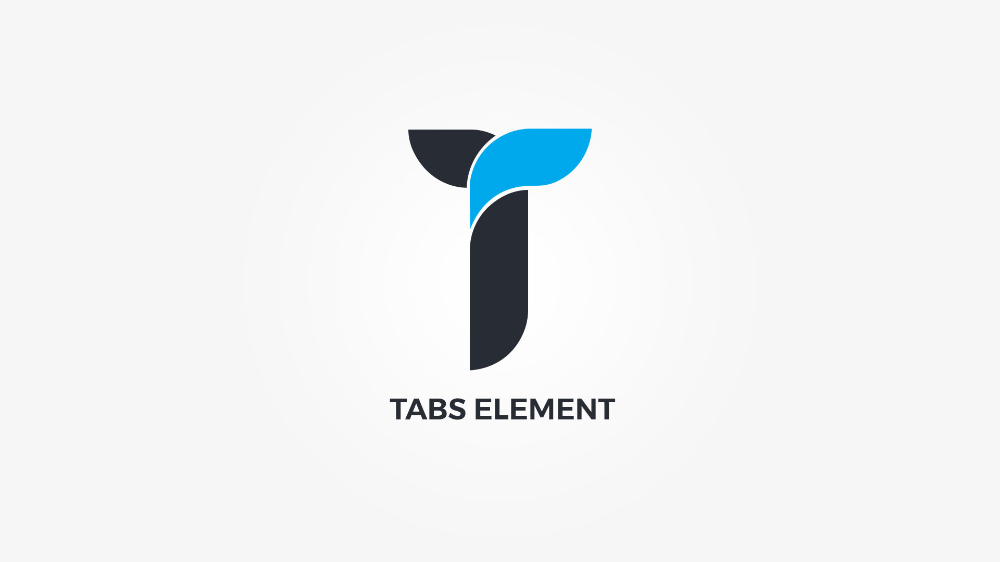

Tabs element displays custom content within tab like containers. Element popup contains following options;

#### Defaults tab{.options-tab}
1. __Sorting title__&nbsp;-&nbsp; Used only in builder for easy sorting.
1. __Tabs__&nbsp;-&nbsp; Create your tabs.
1. __Container metrics__&nbsp;-&nbsp; Add custom class or ID to HTML container and adjust visibility on specific devices.

#### Layout tab{.options-tab}
1. __Container box style__&nbsp;-&nbsp; Adjust .thz-shortcode-tabs box style.
1. __Tab links setting__&nbsp;-&nbsp; Choose tabs links layout, border radius or set the space between the tab links.
1. __Tab link padding__&nbsp;-&nbsp; Set the padding of tabs menu link item.
1. __Content box__&nbsp;-&nbsp; Adjust .thz-tab-content.

#### Styling tab{.options-tab}
1. __Title font__&nbsp;-&nbsp; Tabs title font metrics.
1. __Active link__&nbsp;-&nbsp; Adjust .thz-active-tab .thz-tab-button.
1. __Inactive link__&nbsp;-&nbsp; Adjust .thz-inactive-tab .thz-tab-button.
1. __Tab links colors__&nbsp;-&nbsp; Adjust tab links colors.
1. __Tab content colors__&nbsp;-&nbsp; Adjust tab content colors.

#### Tab item popup{.options-tab}
1. __Title__&nbsp;-&nbsp; Set tab title.
1. __Tab icon__&nbsp;-&nbsp; Select tab icon.
1. __Content__&nbsp;-&nbsp; Set tab content.