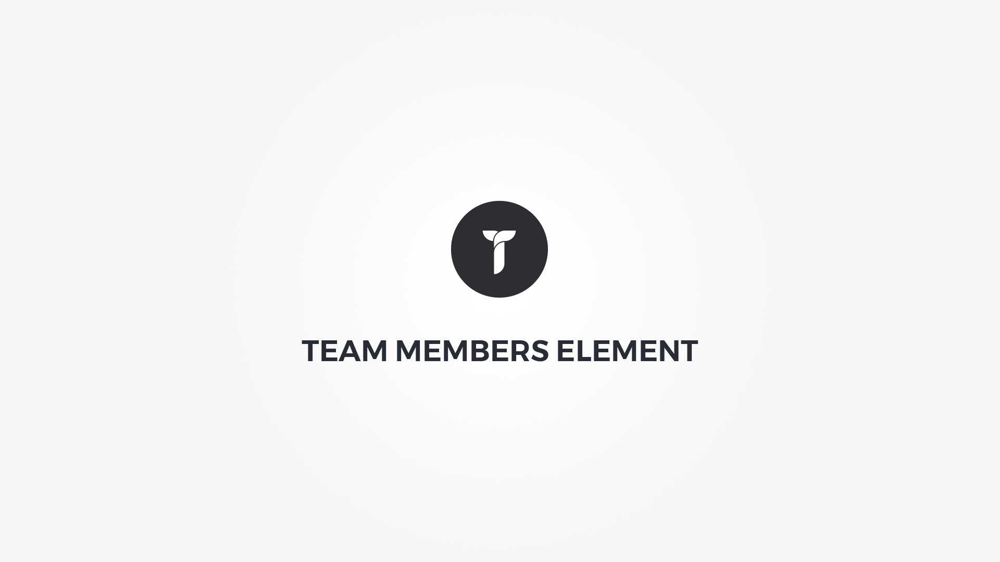

Team Members element displays team members with their image, description and social profile links as a grid or slider layout. Element popup contains following options;

#### Layout tab{.options-tab}
1. __ Container box style __ &nbsp;-&nbsp; Adjust .thz-team-members-holder box style.
1. __ Holder box style __ &nbsp;-&nbsp; Adjust .thz-grid-item-in box style.
1. __ Layout mode __ &nbsp;-&nbsp; Select members layout mode.
1. __ Grid settings __ &nbsp;-&nbsp; Adjust grid settings. If the .thz-grid-item-in width is less than desired min width, the columns number drops down by one in order to honor the min width setting. This adjustment is active only if image container height is anything else but metro. On the other hand if the window width is below 980px and grid has more than 2 columns, only 2 columns are shown. Under 767px 1 column is shown.
1. __ Container metrics __ &nbsp;-&nbsp; Add custom class or ID to HTML container and adjust visibility on specific devices. 

#### Members tab{.options-tab}
   __ Team members__ &nbsp;-&nbsp; popup contains following options;  
   
#### Team members popup Details tab
1. __ Select Image __ &nbsp;-&nbsp; Select or upload an image.
1. __ Name __ &nbsp;-&nbsp; Name of the team member.
1. __ Job Title __ &nbsp;-&nbsp; Job title of the team member.
1. __ Description __ &nbsp;-&nbsp; Enter a few words that describe the team member.

#### Team members popup Socials tab
1. __ Social media links __ &nbsp;-&nbsp; Add member social media link. Drag and drop to reorder.

#### Members mode tab{.options-tab}
1. __ Display mode __ &nbsp;-&nbsp; Select members display mode.
1. __ Overlay background __ &nbsp;-&nbsp; Set overlay background.
1. __ Overlay effect __ &nbsp;-&nbsp; Select overlay hover effect and duration.
1. __ Image effect __ &nbsp;-&nbsp; Select image hover effect and duration.
1. __ Overlay element effect __ &nbsp;-&nbsp; Select overlay element hover effect and duration.
1. __ Overlay distance __ &nbsp;-&nbsp; Distance the overlay from image box edges.

#### Image container tab{.options-tab}
1. __ Image box style __ &nbsp;-&nbsp; Adjust .thz-team-member-media box style. Known issue: If layout mode is slider and you add box-shadow to container, the box shadow is cut off due to sliders overflow hidden. One way to fix this is to add margin in the size of box shadow to the image container.
1. __ Image grayscale __ &nbsp;-&nbsp; Add graysale effect to member image.
1. __ Image size __ &nbsp;-&nbsp; Select the member image size.
1. __ Image container height __ &nbsp;-&nbsp; Set image container height.

#### Info containers tab{.options-tab}
1. __ Info box style __ &nbsp;-&nbsp; Adjust .thz-team-member-info box style.
1. __ Name box style __ &nbsp;-&nbsp; Adjust .thz-team-member-name box style.
1. __ Job box style __ &nbsp;-&nbsp; Adjust .thz-team-member-job box style.
1. __ Description box style __ &nbsp;-&nbsp; Adjust .thz-team-member-description box style.
1. __ Socials box style __ &nbsp;-&nbsp; Adjust .thz-team-member-socials box style.

#### Typography tab{.options-tab}
1. __ Name font __ &nbsp;-&nbsp; Adjust member name font.
1. __ Job font __ &nbsp;-&nbsp; Adjust member job font.
1. __ Description font __ &nbsp;-&nbsp; Adjust member description font.
1. __ Social links alignment __ &nbsp;-&nbsp; Adjust social links metrics.

#### Effects tab{.options-tab}
1. __ Animate members __ &nbsp;-&nbsp; Add animation to the member HTML container.
1. __ Container parallax __ &nbsp;-&nbsp; Activate/deactivate container parallax.