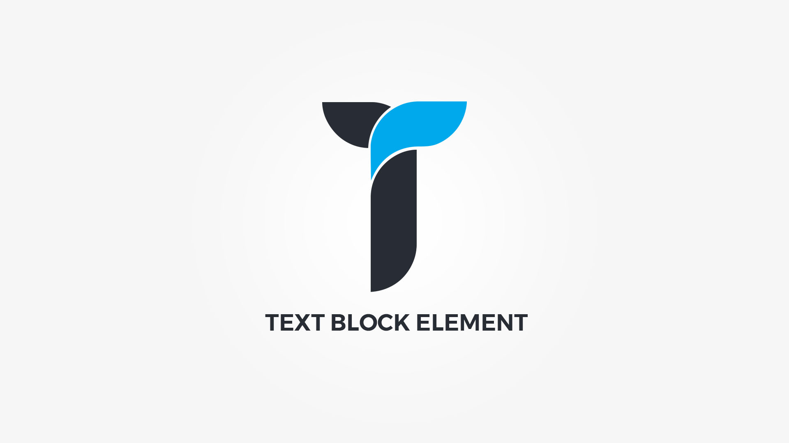

Text Block element display text block within customizable container. Element popup contains following options;

#### Defaults tab{.options-tab}
1. __ Content __ &nbsp;-&nbsp; Enter some content for this text block.
1. __ Container metrics __ &nbsp;-&nbsp; Add custom class or ID to HTML container and adjust visibility on specific devices.

#### Styling tab{.options-tab}
1. __ Container box style __ &nbsp;-&nbsp; Adjust .thz-text-block box style.
1. __ Animate __ &nbsp;-&nbsp; Select the animation effect.