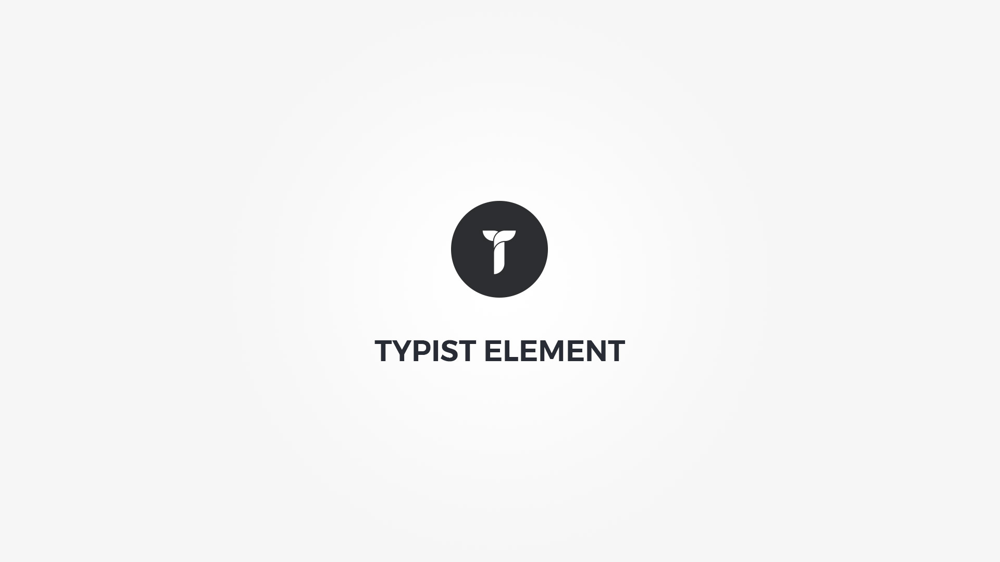

Typist element displays typewriter text animation. The [Typed](https://mattboldt.com/typed.js/docs/) docs or [GitHub repo](https://github.com/mattboldt/typed.js/) will give you more info on available script options. 

Element popup contains following options;

#### Defaults tab{.options-tab}
1. __ Strings __ &nbsp;-&nbsp; Click the button to add new string.
1. __ String before __ &nbsp;-&nbsp; Add a string before typist.
1. __ String after __ &nbsp;-&nbsp; Add a string after the typist.
1. __ Text brakes __ &nbsp;-&nbsp; Add text brake before or after typist.

#### Metrics & Layout tab{.options-tab}
1. __ Container box style __ &nbsp;-&nbsp; Adjust .thz-typist-container box style.
1. __ Script settings __ &nbsp;-&nbsp; Adjust typed script settings.
1. __ Tag __ &nbsp;-&nbsp; Set .thz-typist-holder HTML tag.
1. __ Font settings __ &nbsp;-&nbsp; Adjust font settings.
1. __ Container metrics __ &nbsp;-&nbsp; Add custom class or ID to HTML container and adjust visibility on specific devices.

#### Effects tab{.options-tab}
1. __ Animate	 __ &nbsp;-&nbsp; Add animation to the HTML container.
1. __ Gradient text __ &nbsp;-&nbsp; Use gradient as typist text color. Fallback is color 1 on non webkit browsers. Typist color from Font settings is not used if gradient is active.