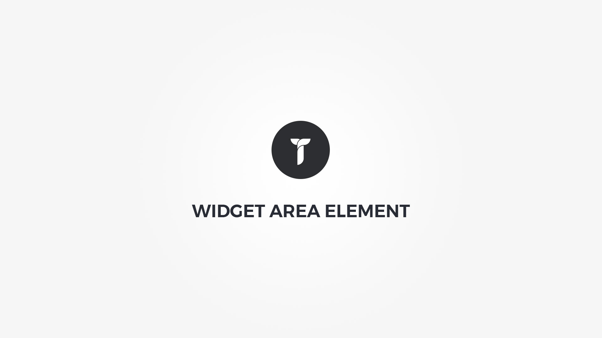

Widget Area element displays any WordPress widget area within customizable container. Element popup contains following options;

1. __ Sidebar __ &nbsp;-&nbsp; Select sidebar.
1. __ Custom sidebar options __ &nbsp;-&nbsp; Add custom sidebar options for this page or leave as is for theme defaults.
1. __ Container box style __ &nbsp;-&nbsp; Adjust .thz-shortcode-widget-area box style.
1. __ Container metrics __ &nbsp;-&nbsp; Add custom class or ID to HTML container and adjust visibility on specific devices.