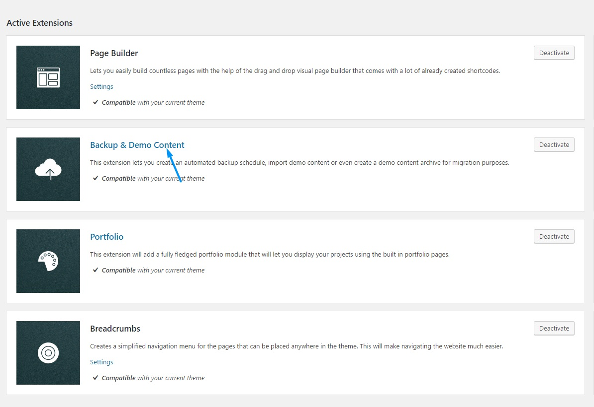

	<h3 class="thz-notification-title">Deactivation info</h3>
	

	<strong>Please note that many theme parts like demo install depend on this extension and we do not recommend it's deactivation.</strong>
	

<a href="http://unyson.io/" target="_blank">__Unyson__</a> theme framework __Backup & Demo Content__ extension allows you to backup and or restore your WordpRess installation and provides demo installation utility for Creatus WordPress theme. If you wish to disable it please locate __Unyson __ in left side vertical menu. Than click on Backup & Restore extension __Deactivate__ button to deactivate. To find out more about this extension please visit <a href="http://manual.unyson.io/en/latest/extension/backups/index.html" target="_blank">__Unyson Backup & Demo Content Extension manual__</a>.

