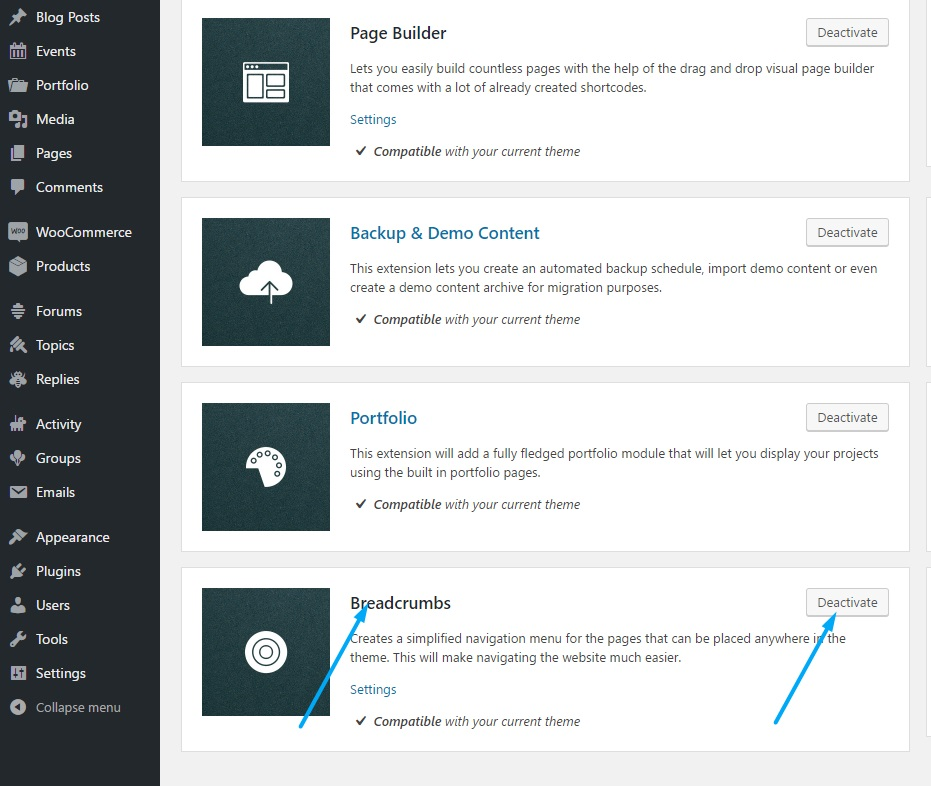

<a href="http://unyson.io/" target="_blank">__Unyson__</a> theme framework__Breadcrumbs__extension creates navigation menu for the pages that can be placed anywhere in the theme. If you wish to disable it please locate__Unyson__in left side vertical menu. Than click on Breadcrumbs extension__Deactivate__button to deactivate. 

__Please note that theme hero and page title sections are using this extension. If this extension is disabled a fallback to simple breadcrumbs function is activated. __

To find out more about Unyson Breadcrumbs extension please visit <a href="http://manual.unyson.io/en/latest/extension/breadcrumbs/" target="_blank">__Unyson Breadcrumbs Extension manual__</a>.

