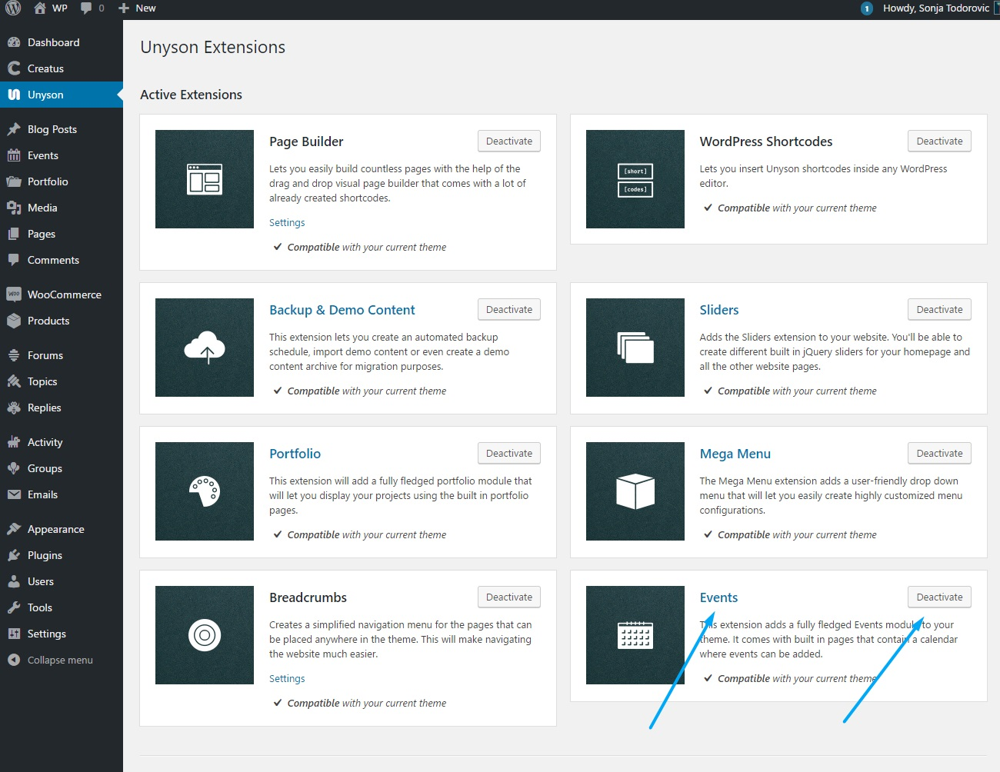

<a href="http://unyson.io/" target="_blank">__Unyson__</a> theme framework__Events__extension allows you to create Events section on your WordpRess installation. If you wish to disable it please locate__Unyson__in left side vertical menu. Than click on Events extension__Deactivate__button to deactivate. 

Please note that we have <a href="https://themezly.com/docs/events/">__extended default Unyson Events extension options__</a> to fit the Creatus WordPress theme. To find out more about Unyson Events extension please visit <a href="http://manual.unyson.io/en/latest/extension/events/" target="_blank">__Unyson Events Extension manual__</a>.

