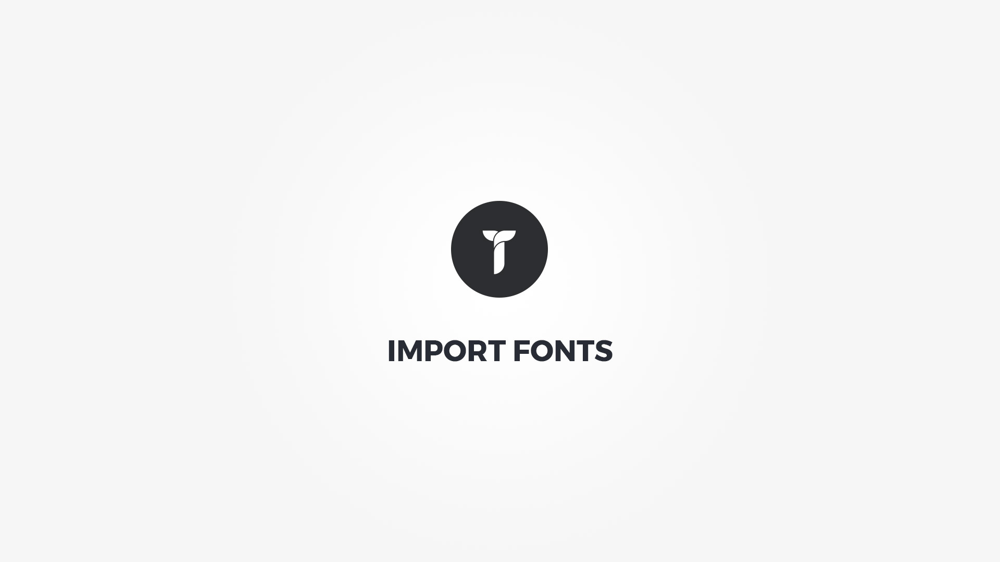

Beside the ability to use any of the 800+ __[Google Fonts](https://fonts.google.com/)__, Creatus comes with an advanced import fonts utility that will import fonts from __[FontSquirel](https://www.fontsquirrel.com/)__, __[Typekit](https://typekit.com/)__ and __your own @font-face kits__. Once imported, all the fonts that you have chosen will be visible in typography option an their styles are automatically enqued. 

### FontSquirel

To add the fonts from __[FontSquirel](https://www.fontsquirrel.com/)__ go to Creatus Import Fonts area __FontSquirel tab__ , find the font you need and click on it's download icon. After the download the font will be available in the typography options throughout the site. 

### Typekit

To add the fonts from __[Typekit](https://typekit.com/)__ go to Creatus Import Fonts area __Typekit tab__;
1. Add your __[Typekit API Token](https://typekit.com/account/tokens)__
1. Click on the __ Click to add kit ID button__ . 
1. In the addable input text add your __kit ID__ . 
1. After the font is available in the list click on __Save Changes__ button. 

Your Typekit fonts are now  available in the typography options throughout the site.

### Custom @font-face kits

If you prefer self hosted @font-face kits over Google fonts or Typekit you can add your own @font-face kit within the Creatus child theme folder.
To do so follow these simple steps.

1. Place your __@font-face kit in __ `creatus-child/ANY_SUB_FOLDER`.
4. In __functions.php add a filter__ with your font kit details;

<pre class="prettyprint light">
/*
 * Use this function as an example
 * on how to add your own @font-face kit.
 * Make sure that font files reside 
 * in same folder as the @font-face kit.
 *
 * There are two acceptable kit fonts
 * formats examples that you can use.
 */
function my_filter_add_fontface_kits ( $custom_kits ){
	
	$custom_kits = array(
    
        /*
         * You can add more than
         * one font-family per kit
		 * and also have multiple kits.
		 * Just make sure that all
		 * @font-face are properly declared
		 * in the kit stylesheet like;
		 * @font-face {
		 *		font-family: 'Open Sans';
		 *		src: url('path_to_400_weight.woff') format('woff');
		 *		font-weight: 400;
		 *		font-style: normal;
		 *	}
		 * @font-face {
		 *		font-family: 'Open Sans';
		 *		src: url('path_to_600_weight.woff') format('woff');
		 *		font-weight: 600;
		 *		font-style: normal;
		 *	}
		 *
		 * OR
		 *
		 * @font-face {
		 *		font-family: 'open_sans_regular';
		 *		src: url('path_to_open_sans_regular.woff') format('woff');
		 *		font-weight: normal;
		 *		font-style: normal;
		 *	}
		 * @font-face {
		 *		font-family: 'open_sans_semi_bold';
		 *		src: url('path_to_open_sans_semi_bold.woff') format('woff');
		 *		font-weight: normal;
		 *		font-style: normal;
		 *	}		 
         */
        'kit1' => array( // kit name /ID
			 /* 
			  * Set kit CSS file uri and path. 
			  * This folder must be accessible
			  * otherwise the kit will not be available.
			  */            
            'css_file_path' 	=> thz_theme_file_path('/KIT1_FOLDER/KIT_STYLE_NAME.css'),
            'css_file_uri' 		=> thz_theme_file_uri('/KIT1_FOLDER/KIT_STYLE_NAME.css'),
            
            'fonts' => array( // kit fonts collection
            	
               /*
                * Use this format if all weights are 
                * using same font-family name
                */
                'roboto' => array( // font key
                    'name' => 'Roboto', // Label for typography option
                    'family' => 'Roboto', // Font family used in frontend, should be same as in CSS
                    'variants' => array(
                        '400',
                        '400italic',
                        '500',
                        '500italic',
                    )
                ),
                
                'open_sans' => array( // font key
                    'name' => 'Open Sans', // Label for typography option
                    'family' => 'Open Sans', // Font family used in frontend, should be same as in CSS
                    'variants' => array(
                        '400',
                        '400italic',
                        '600',
                        '600italic',
                    )
                ),
        		
                
               /*
                * Use this format if each weight has 
                * own font-family name.
				* Make sure variant is set to false
				* for each weight.
                */
                'roboto_regular' => array(
                    'name' => 'Roboto',
                    'family' => 'roboto_regular',
                    'variants' => false
                ),
                'roboto_italic' => array(
                    'name' => 'Roboto Italic',
                    'family' => 'roboto_italic',
                    'variants' => false
                ),
                'roboto_medium' => array(
                    'name' => 'Roboto Medium',
                    'family' => 'roboto_medium',
                    'variants' => false
                ),
                'roboto_medium_italic' => array(
                    'name' => 'Roboto Medium Italic',
                    'family' => 'roboto_medium_italic',
                    'variants' => false
                ),
                
                
                'open_sans_regular' => array(
                    'name' => 'Open Sans',
                    'family' => 'open_sans_regular',
                    'variants' => false
                ),
                'open_sans_italic' => array(
                    'name' => 'Open Sans Italic',
                    'family' => 'open_sans_italic',
                    'variants' => false
                ),
                'open_sans_semi_bold' => array(
                    'name' => 'Open Sans Semi-Bold',
                    'family' => 'open_sans_semi_bold',
                    'variants' => false
                ),
                'open_sans_semi_bold_italic' => array(
                    'name' => 'Open Sans Semi-Bold Italic',
                    'family' => 'open_sans_semi_bold_italic',
                    'variants' => false
                ),
            )
        ),
        
        
        
        'kit2' => array( // kit name /ID
            
            'css_file_path' 	=> thz_theme_file_path('/KIT2_FOLDER/KIT_STYLE_NAME.css'),
            'css_file_uri' 		=> thz_theme_file_uri('/KIT2_FOLDER/KIT_STYLE_NAME.css'),
            
            'fonts' => array(
        
                'open_sans' => array(
                    'name' => 'Open Sans',
                    'family' => 'open_sans',
                    'variants' => false
                ),
                'open_sans_italic' => array(
                    'name' => 'Open Sans Italic',
                    'family' => 'open_sans_italic',
                    'variants' => false
                ),
                'open_sans_semi_bold' => array(
                    'name' => 'Open Sans Semi-Bold',
                    'family' => 'open_sans_semi_bold',
                    'variants' => false
                ),
                'open_sans_semi_bold_italic' => array(
                    'name' => 'Open Sans Semi-Bold Italic',
                    'family' => 'open_sans_semi_bold_italic',
                    'variants' => false
                ),
            )
        ),

	);
	
	return $custom_kits;
}

add_filter('thz_filter_add_fontface_kits', 'my_filter_add_fontface_kits' );
</pre>