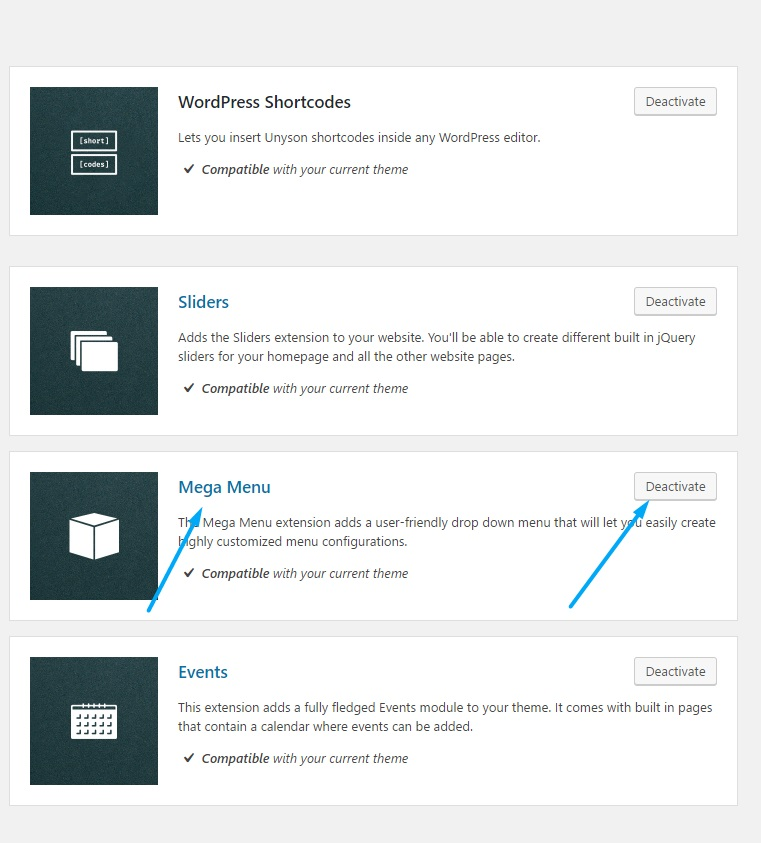

<a href="http://unyson.io/" target="_blank">__Unyson__</a> theme framework__Mega Menu__extension allows you to create mega menu rows within the theme top menu. If you wish to disable it please locate__Unyson__in left side vertical menu. Than click on Mega menu extension__Deactivate__button to deactivate. 

Please note that we have <a href="https://themezly.com/docs/navigation-menu-options/">__extended default Unyson Mega menu extension options__</a> to fit the Creatus WordPress theme. To find out more about Unyson Mega menu extension please visit <a href="http://manual.unyson.io/en/latest/extension/megamenu/" target="_blank">__Unyson Mega menu Extension manual__</a>.

