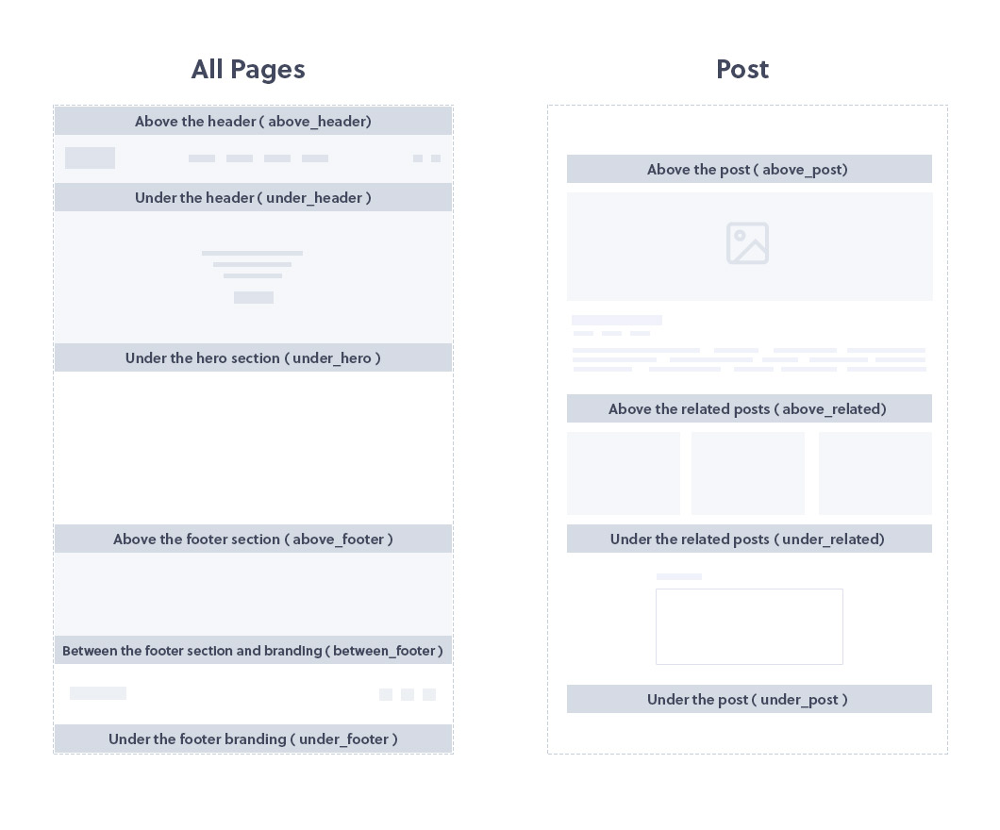

Page block is a custom post type that will help you create custom content for specific theme positions. You can also use a page block instead of site hero section or footer. Please note that this post type __must utilize the theme page builder__ in order to create a page block. Page block contains following options; 

1. __Block Position__ &nbsp;-&nbsp; Select page block position. See positions map image below.
1. __ Block Assignment__ &nbsp;-&nbsp; Select page block assignment. Not effective if "Assign to" option is empty.
1. __ Assign to __ &nbsp;-&nbsp; Assign the page block to specific page. Select from the list or start typing to load specific pages. If empty page block is visible on all pages.
1. __Block visibility__ &nbsp;-&nbsp; Select user roles that can see the page block.
1. __Visible to__ &nbsp;-&nbsp; If unchecked everyone can still see the page block. If you select Logged in than all users that are logged in will see this block. For more restrictive visibility do not use Logged in but rather select the user role. Logged out option makes this block visible to site visitors only.

### Page blocks positions map

Use the position map above to assign the page block to desired position. Note that multiple page blocks can be assigned to same position. If you need to sort their order we recommend you use __[Post Types Order](https://wordpress.org/plugins/post-types-order/)__ plugin for blocks reorder.

### Using the page block instead of hero section or footer

Page block can also be used instead of theme __hero section__ or __footer__. Watch the video above to understand how to acheive this.

### Adding custom page block position

There are currently 10 page blocks positions that you can use. If you wish to add more please use this filter;

<pre class="prettyprint light">
function my_filter_pageblocks_positions_list ( $custom_kits ){
	
	$custom_positions = array(
		'my_position' 		=> esc_html__('My position name', 'creatus'),
	);
	
	return $custom_positions;
}

add_filter('thz_filter_pageblocks_positions_list', 'my_filter_pageblocks_positions_list' );
</pre>

Than anywhere in the child theme where you wish your position to appear add following function;

<code>&lt;?php thz_page_block($position, $echo);?&gt;</code>

#### Function attributes:
1. __$position__ &nbsp;-&nbsp; Page block position name.
1. __$echo__ &nbsp;-&nbsp; __true__ by default, return if __false__.

#### Usage example:
<pre class="prettyprint light">
&lt;?php thz_page_block('my_position'); ?&gt;
</pre>

