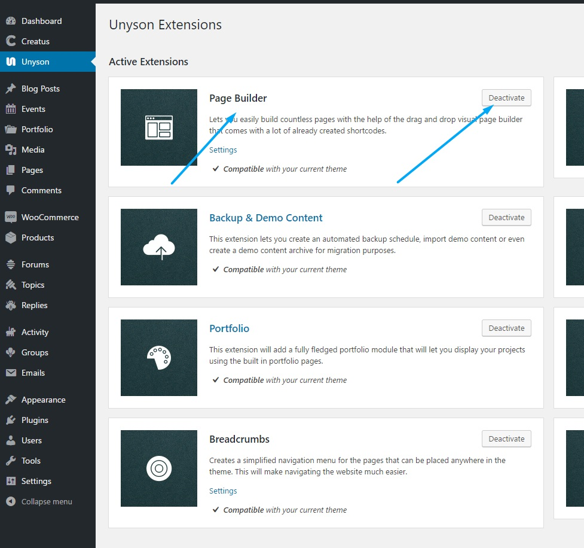

	<h3 class="thz-notification-title">Deactivation info</h3>
	

	<strong>Please note that many theme parts like widgets generators, shortcodes and all visual builders depend on this extension and we do not recommend it's deactivation.</strong>
	

<a href="http://unyson.io/" target="_blank">__Unyson__</a> theme framework__Page builder__extension allows you to create custom pages and insert shortcodes on your WordpRess installation. If you wish to disable it please locate__Unyson__in left side vertical menu. Than click on Page builder extension__Deactivate__button to deactivate. To find out more about Unyson Builder extension please visit <a href="http://manual.unyson.io/en/latest/extension/builder/" target="_blank">__Unyson Builder Extension manual__</a>.

