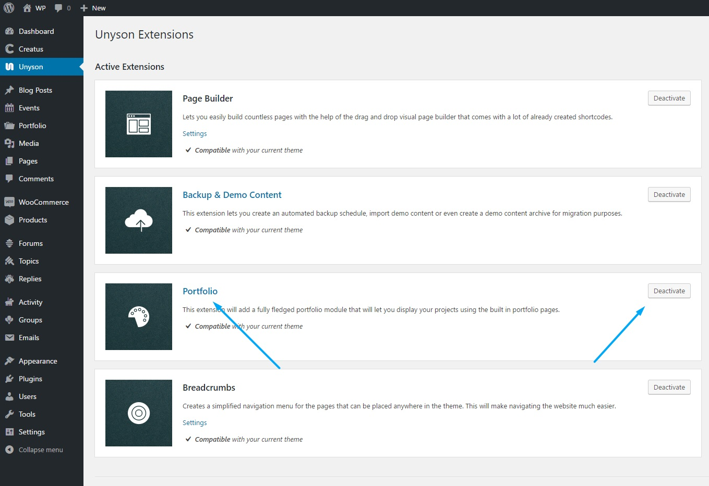

<a href="http://unyson.io/" target="_blank">__Unyson__</a> theme framework __Portfolio__ extension allows you to create Portfolio section on your WordpRess installation. Our theme demos come with the Portfolio extension automatically enabled. If you wish to disable it please locate __Unyson __ in left side vertical menu. Than click on Portfolio extension __Deactivate__ button to deactivate. 

Please note that we have <a href="https://themezly.com/docs/portfolio-project-options/">__extended default Unyson Portfolio extension options__</a> to fit the Creatus WordPress theme. To find out more about Unyson Portfolio extension please visit <a href="http://manual.unyson.io/en/latest/extension/portfolio/" target="_blank">__Unyson Portfolio Extension manual__</a>.

