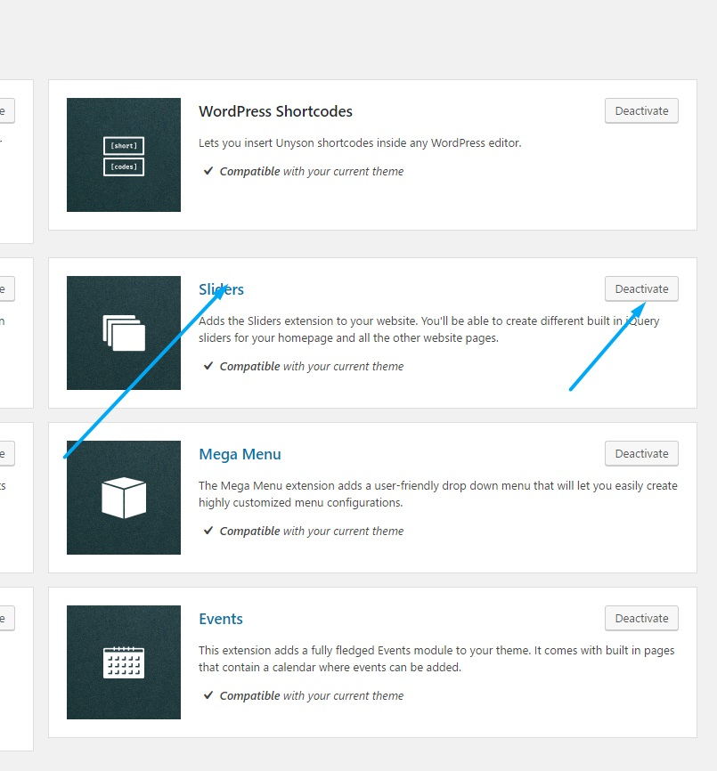

<a href="http://unyson.io/" target="_blank">__Unyson__</a> theme framework__Sliders__extension allows you to create Sliders and use them in your WordpRess installation. If you wish to disable it please locate__Unyson__in left side vertical menu. Than click on Sliders extension__Deactivate__button to deactivate. To find out more about Unyson Sliders extension please visit <a href="http://manual.unyson.io/en/latest/extension/sliders/" target="_blank">__Unyson Sliders Extension manual__</a>.

