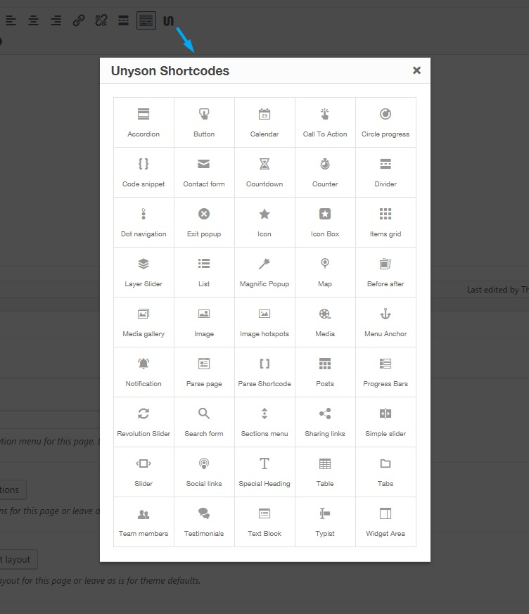

<a href="http://unyson.io/" target="_blank">__Unyson__</a> theme framework__WordPress Shortocdes__extension brings all shortcodes__( except sections and columns )__ to your WordPress editor. We__recomend__leaving this extension active at all times since it can be used troughtout all your post types.  To find out more about Unyson WordPress Shortocdes extension please visit <a href="http://manual.unyson.io/en/latest/extension/wp-shortcodes/index.html#content" target="_blank">__Unyson WordPress Shortocdes Extension manual__</a>.

