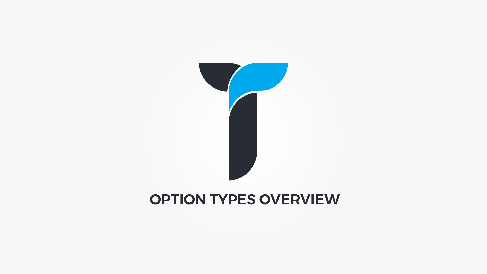

	

Creatus WordPress Theme is built on top of __Unyson theme framework__ and comes with all it's built in __[options types](http://manual.unyson.io/en/latest/options/built-in/introduction.htm)__. Beside the Unsyon defaults, we have built __30+ additional__ option types that made the theme development process easier. 

In this section you can find __only__ highlighted and __mostly used__ option types and their usage examples. Any option types that are not listed in this section are for internal use only and their support is limited.

