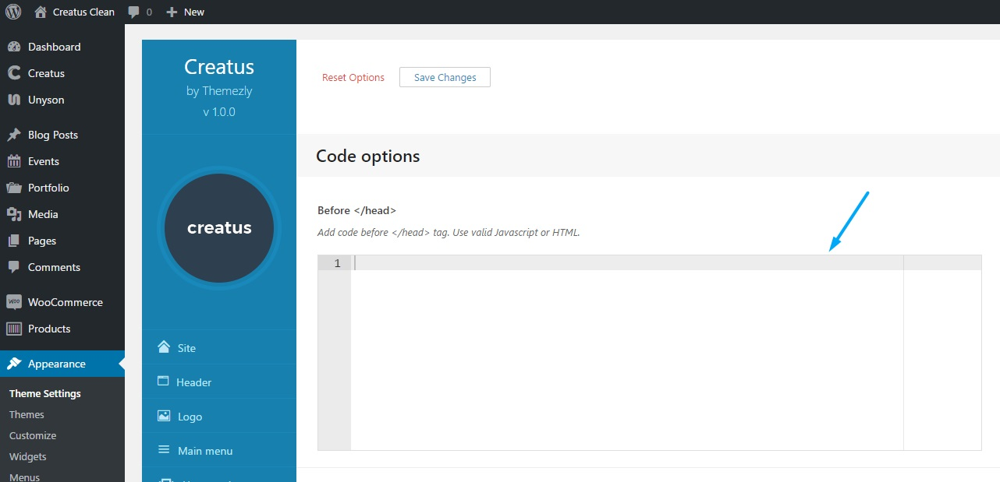

Thz Ace is a code editor text area that is using__[ace.js](https://ace.c9.io/)__for syntax highlighting.

#### option snippet

<pre class="pre-scrollable prettyprint light">
'option_name' => array(
	'type' => 'thz-ace',
	'label' =>__('Option label', '{domain}'),
	'desc' => esc_html__('Option description.', '{domain}'),
	'help' => esc_html__('Option help.', '{domain}'),
	'value'=>'',
	'mode'=>'html', // css,html,javascript,json
	'theme'=>'chrome', // chrome, tomorrow_night
	'height'=>250
)
</pre>