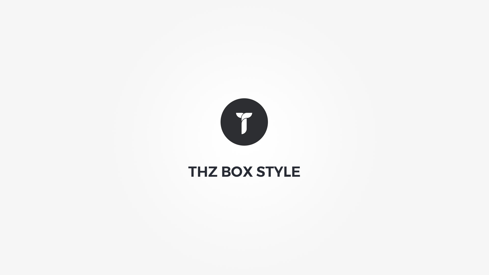

Thz Box Style is full layout option type with visual reference for border, border radius and background.
#### option snippet simple
<pre class="pre-scrollable prettyprint light">
'option_name' => array(
	'type' => 'thz-box-style',
	'label' => __('Option label', '{domain}'),
	'desc' => esc_html__('Option description.', '{domain}'),
	'help' => esc_html__('Option help.', '{domain}'),
	'value'=> array(),
	'preview' => true, // display border,boxshadow and bacground preview,
	'popup' => true, // display option in a popup
	'button-text' =>  esc_html__('Customize box style', '{domain}'), // popup button text
	// displays only margin and padding
	'disable' => array('layout','borders','boxshadow','borderradius','boxsize','background') 
	
	/*
	  Disable array disables specific option sections 
		layout
		padding
		margin
		borders
		borderradius
		boxsize
		boxshadow
		background
		video // display background but disable background video option
	*/
)
</pre>

#### option snippet full

<pre class="pre-scrollable prettyprint light">
'option_name' => array(
	'type' => 'thz-box-style',
	'label' => __('Option label', '{domain}'),
	'desc' => esc_html__('Option description.', '{domain}'),
	'help' => esc_html__('Option help.', '{domain}'),
	'value'=> array(
		'layout' => array(
			'display' => 'default',
			'float' => 'default',
			'clear' => 'default',
			'overflow' => 'default',
			'opacity' => '',
			'visibility' => 'default',
			'position' => 'default',
			'top' => 'auto',
			'right' => 'auto',
			'bottom' => 'auto',
			'left' => 'auto',
			'z-index' => 'auto',
		),
		'padding' => array(
			'top' => '',
			'right' => '',
			'bottom' => '',
			'left' => '',
		) ,
		'margin' => array(
			'top' => '',
			'right' => '',
			'bottom' => '',
			'left' => '',
		) ,
		'borders' => array(
			'all'=> 'same',			
			'top'=> array(
				'w' => '',
				's' => 'solid',
				'c' => ''
			),
			'right'=> array(
				'w' => '',
				's' => 'solid',
				'c' => ''
			),
			'bottom'=> array(
				'w' => '',
				's' => 'solid',
				'c' => ''
			),
			'left'=> array(
				'w' => '',
				's' => 'solid',
				'c' => ''
			)
		),
		'borderradius' => array(
			'top-left' => '',
			'top-right' => '',
			'bottom-right' => '',
			'bottom-left' => '',
		),
		'boxsize' => array(
			'width' => '',
			'height' => '',
			'min-width' => '',
			'min-height' => '',
			'max-width' => '',
			'max-height' => ''
		),
		'boxshadow' => array(),
		'background' => array(
			'type' => 'none',
		),
		'css'=>''
	)
)
</pre>

#### option snippet frontend print helper function

<pre class="pre-scrollable prettyprint light">
// css print
$box_style 			= thz_get_theme_option('option_name');
$box_style_print	= thz_print_box_css($box_style);
if(!empty($box_style_print)){
	$css = '.some_element{'.$box_style_print.'}';
}
</pre>