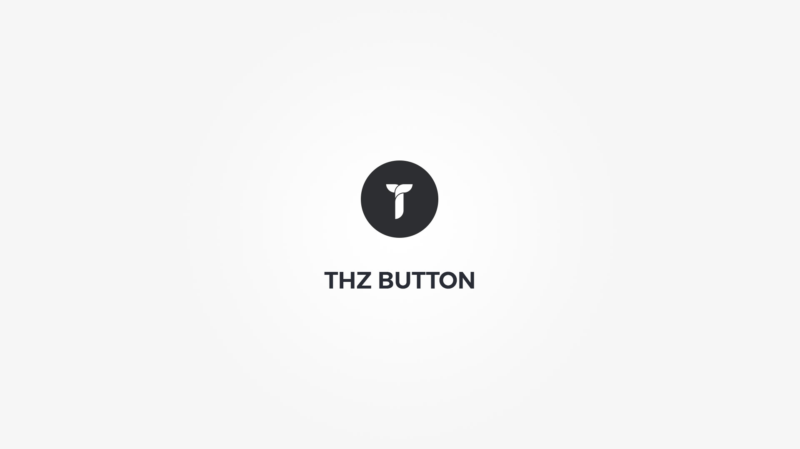

Thz Button is a button generator option type.

#### option snippet

<pre class="pre-scrollable prettyprint light">
'option_name' => array(
	'type' => 'thz-button',
	'label' => __('Option label', '{domain}'),
	'desc' => esc_html__('Option description.', '{domain}'),
	'help' => esc_html__('Option help.', '{domain}'),
	'value' => array(
		'buttonText'=>'Button',
		'activeColor' => 'theme',
		'buttonSizeClass' => 'small',
	),
)
</pre>
