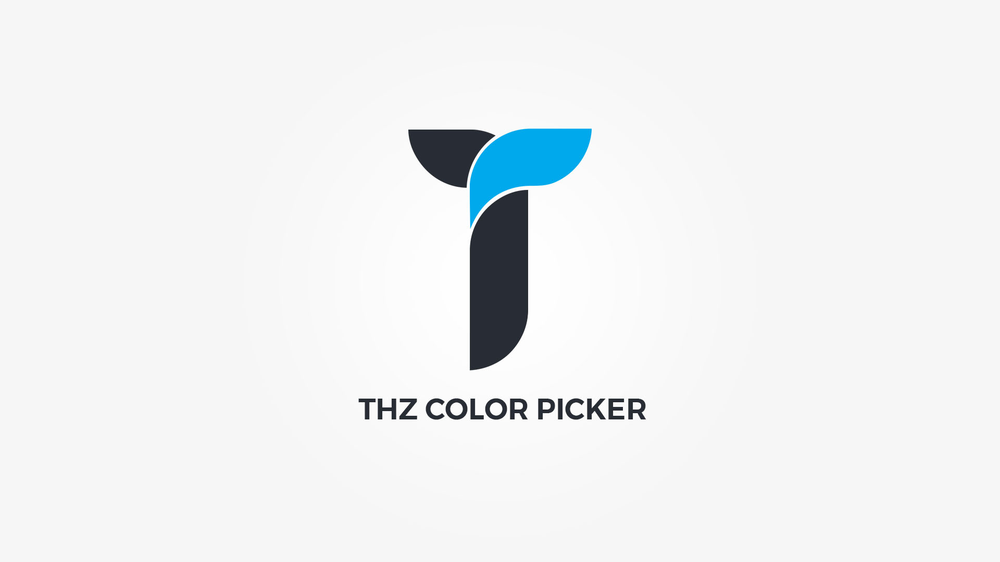

Thz Color Picker is color picker option type with multiple color sets that include theme color palette combos, flat and material UI colors and it also accepts rgba color values.

#### option snippet

<pre class="pre-scrollable prettyprint light">
'option_name' => array(
	'type' => 'thz-color-picker',
	'label' => __('Option label', '{domain}'),
	'desc' => esc_html__('Option description.', '{domain}'),
	'help' => esc_html__('Option help.', '{domain}'),
	'value'=> '',
)
</pre>

Note that palette colors are saved as palete color names eg; __color_1, color_2__. To convert them to color code values use the palette color processing function;

#### frontend pallete color processing function 

<pre class="pre-scrollable prettyprint light">
$color = thz_get_option('option_name');
$color = thz_replace_palette_colors( $color );
</pre>