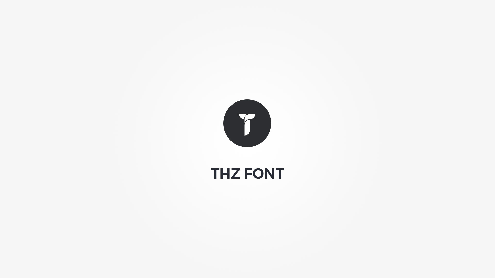

Thz Font option type is an option type that will let you adjust font size, weight, letter spacing, line height, style, text transform, alignment, color, hovered color and includes a text shadow generator.

#### option snippet simple

<pre class="pre-scrollable prettyprint light">
'option_name' => array(
	'type' => 'thz-font',
	'label' => __('Option label', '{domain}'),
	'desc' => esc_html__('Option description.', '{domain}'),
	'help' => esc_html__('Option help.', '{domain}'),
	'value' => array(),
	'cssprint' => true // print css
)
</pre>

#### option snippet full

<pre class="pre-scrollable prettyprint light">
'option_name' => array(
	'type' => 'thz-font',
	'label' => __('Option label', '{domain}'),
	'desc' => esc_html__('Option description.', '{domain}'),
	'help' => esc_html__('Option help.', '{domain}'),
	'value' => array(
		'size' => '',
		'weight' => 'default',
		'spacing' => '',
		'line-height' => '',
		'style' => 'default',
		'transform' => 'default',
		'align' => 'default',
		'color' => '',
		'hovered' => '',
		'text-shadow' => array(),
		//'disable' => array('size','weight','spacing','line-height','style','transform','align','color','hovered','text-shadow'),
	),
	'cssprint' => true // print css
)
</pre>

Note that hover color is not printed in css.

#### frontend font processing function 

<pre class="pre-scrollable prettyprint light">
$font = thz_get_option('option_name');
$font_css = thz_font_css( $font );
</pre>