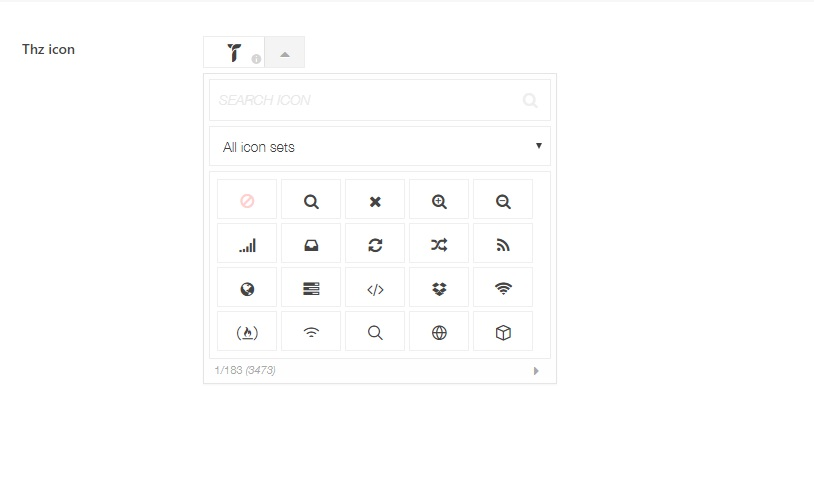

Thz Icon option type is an option type that will let you select an icon from__3400+__custom picked icons.

#### option snippet simple

<pre class="pre-scrollable prettyprint light">
'option_name' => array(
	'type' => 'thz-icon',
	'label' =>__('Option label', '{domain}'),
	'desc' => esc_html__('Option description.', '{domain}'),
	'help' => esc_html__('Option help.', '{domain}'),
	'value' => 'thzicon thzicon-themezly',
)
</pre>

#### option snippet array

<pre class="pre-scrollable prettyprint light">
'option_name' => array(
	'type' => 'thz-icon',
	'label' =>__('Option label', '{domain}'),
	'desc' => esc_html__('Option description.', '{domain}'),
	'help' => esc_html__('Option help.', '{domain}'),
	'value' => array(
		'icon' => 'thzicon thzicon-themezly',
		'size' => 28,
		'color' => 'color_1'
	),
)
</pre>

## Adding custom icons to existing icons set

To add custom icons to thz-icon option type add following filter in your__child-theme functions.php__file;

<pre class="pre-scrollable prettyprint light">
function my_filter_font_icon_packs ($packs){

	$packs =  array(
		'myicons' => array(
			'title' => 'Icons pack name',
			'css_class_prefix' => 'icon_css_prefix', // eg; fa
			'css_file_path' => thz_theme_file_path('/some_child_theme_folder/style.css'),
			'css_file_uri' => thz_theme_file_uri('/some_child_theme_folder/style.css'),
		)
	);
	
    return $packs;
}

add_filter('thz_filter_font_icon_packs', 'my_filter_font_icon_packs');
</pre>

__Note that you need to enque frontent icons stylesheet on your own. __

Transient used to save custom icon pack is `thz_custom_font_icon_packs`  and is__refreshed every 7 days__. Transient can be deleted when filter is removed or with  `delete_transient('thz_custom_font_icon_packs')` function. 