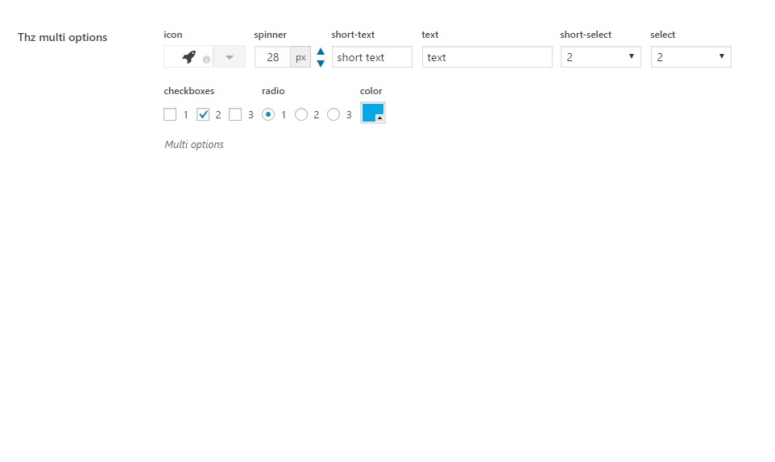

Thz Multi Option is an option type that combines multiple option types in to one.

#### option snippet

<pre class="pre-scrollable prettyprint light">
'option_name' => array(
	'type' => 'thz-multi-options',
	'label' => __('Option label', '{domain}'),
	'desc' => esc_html__('Option description.', '{domain}'),
	'help' => esc_html__('Option help.', '{domain}'),
	'value' => array(
		'icon' => 'fa fa-rocket',
		'spinner' => 28,
		'short-text' => 'short text',
		'text' => 'text',
		'short-select' => 'two',
		'select' => 'two',
		'checkboxes' => array(
			'two' => true
		),
		'radio' => 'two',
		'color' => 'color_1'
	),
	'breakafter'=>'select',
	'thz_options' => array(
		'icon' => array(
			'type' => 'icon',
			'title' => esc_html__('icon', '{domain}'),
		),
		'spinner' => array(
			'type' => 'spinner',
			'title' => esc_html__('spinner', '{domain}'),
			'addon' => 'px'
		),
		'short-text' => array(
			'type' => 'short-text',
			'title' => esc_html__('short-text', '{domain}'),
		),
		'text' => array(
			'type' => 'text',
			'title' => esc_html__('text', '{domain}'),
		),
		'short-select' => array(
			'type' => 'short-select',
			'title' => esc_html__('short-select', '{domain}'),
			'choices' => array(
				'one' => esc_html__('1', '{domain}'),
				'two' => esc_html__('2', '{domain}'),
				'three' => esc_html__('3', '{domain}'),
			)
		),
		'select' => array(
			'type' => 'short-select',
			'title' => esc_html__('select', '{domain}'),
			'choices' => array(
				'one' => esc_html__('1', '{domain}'),
				'two' => esc_html__('2', '{domain}'),
				'three' => esc_html__('3', '{domain}'),
			)
		),
		'checkboxes' => array(
			'type' => 'checkboxes',
			'title' => esc_html__('checkboxes', '{domain}'),
			'choices' => array(
				'one' => esc_html__('1', '{domain}'),
				'two' => esc_html__('2', '{domain}'),
				'three' => esc_html__('3', '{domain}'),
			)
		),
		'radio' => array(
			'type' => 'radio',
			'title' => esc_html__('radio', '{domain}'),
			'choices' => array(
				'one' => esc_html__('1', '{domain}'),
				'two' => esc_html__('2', '{domain}'),
				'three' => esc_html__('3', '{domain}'),
			)
		),
		'color' => array(
			'type' => 'color',
			'title' => esc_html__('color', '{domain}'),
			'box' => true
		)
	)
)
</pre>