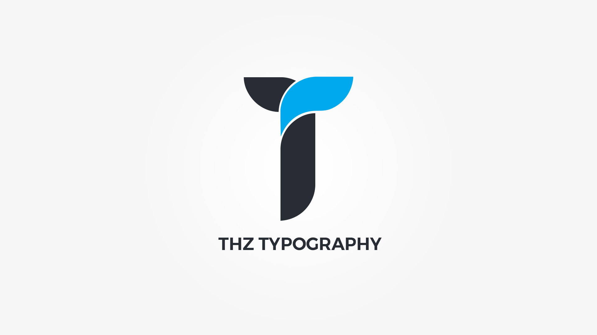

Thz Typography is an option type that will help you pick font family from 15 predefined web safe fonts families, choose font familly from __[800+ Google fonts](https://fonts.google.com/)__. You ca also adjust font size, weight, letter spacing, line height, style, text transform, alignment and color or use built in text shadow generator to aditionaly style your font. 

If your favorite webfont is not in the list or you simply need more webfonts please see __[Import fonts utility](https://themezly.com/docs/import-fonts/)__

#### option snippet

<pre class="pre-scrollable prettyprint light">
'option_name' => array(
	'type' => 'thz-typography',
	'label' => __('Option label', '{domain}'),
	'desc' => esc_html__('Option description.', '{domain}'),
	'help' => esc_html__('Option help.', '{domain}'),
	'value' => array(
		'family'  		=> 'default',
		'size' 			=> '',
		'weight'     	=> 'default',
		'style'     	=> 'default',
		'subset'    	=> false, // array of font subsets if used
		'line-height' 	=> '',
		'spacing'		=> '',
		'transform' 	=> 'default',
		'align'     	=> 'default',
		'color' 		=> '',
		'hovered' 		=> '',
		'text-shadow' 	=> array()
	),
	'cssprint' => true, // auto saves font CSS
	'cssclasses' => false, // auto saves font class names
	'disable' => array(), // what to disable, ex: array('size')
	/* used to limit class names, 
	 * ex: biggest font classs size is thz-fs-100, 
	 * if you increase it dont forget to add new class names in your stylesheet
	 */
	'sizelimit' => 100, 

)
</pre>

### Frontend typography processing function 

<pre class="pre-scrollable prettyprint light">
$typography 	= thz_get_option('option_name');
$typography_css = thz_typo_print( $typography );
</pre>

### Adding custom font stacks to standard fonts list

To add custom font stacks to standard fonts list use this filter;

<pre class="prettyprint light">
function my_filter_typography_standard_fonts ( $custom_list ){
	
	$custom_list = array(
		"'Arial Black', Gadget, sans-serif"
	);
	
	return $custom_list;
}

add_filter('thz_filter_typography_standard_fonts', 'my_filter_typography_standard_fonts' );
</pre>

	

	<strong>Please make sure that you are using double quote for the array value as shown above.</strong>
	

