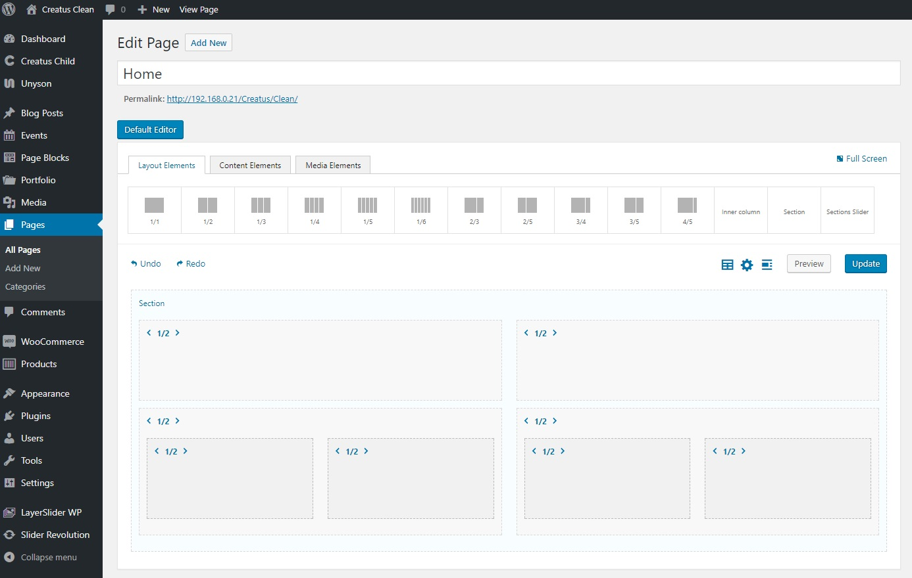
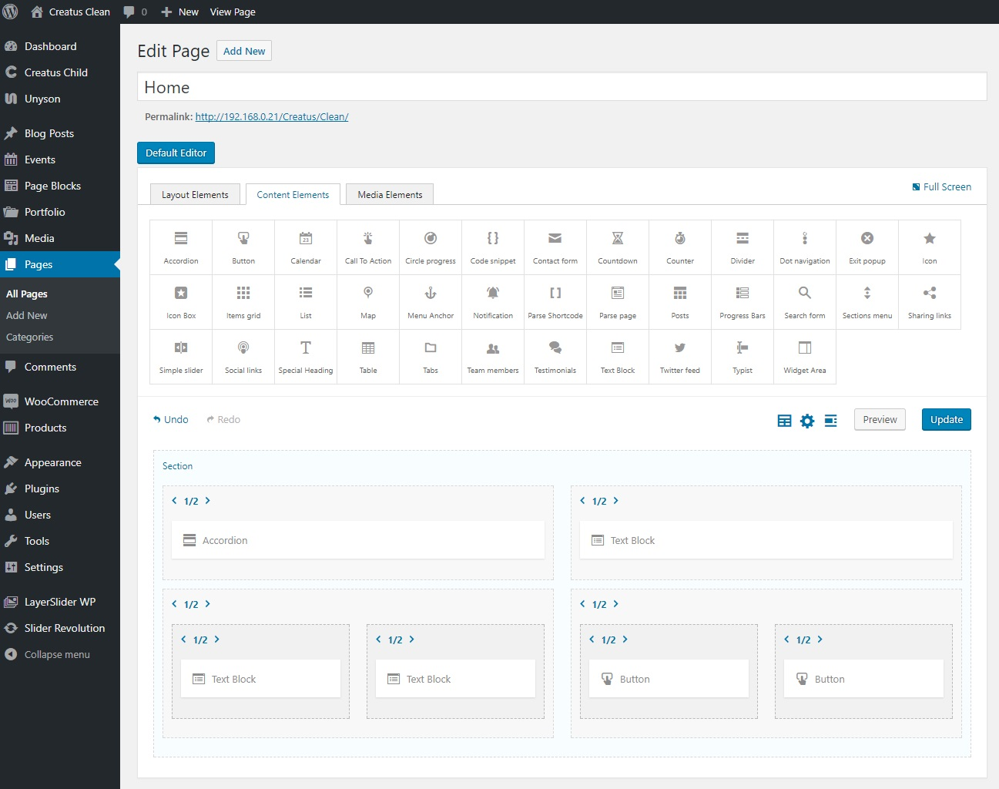
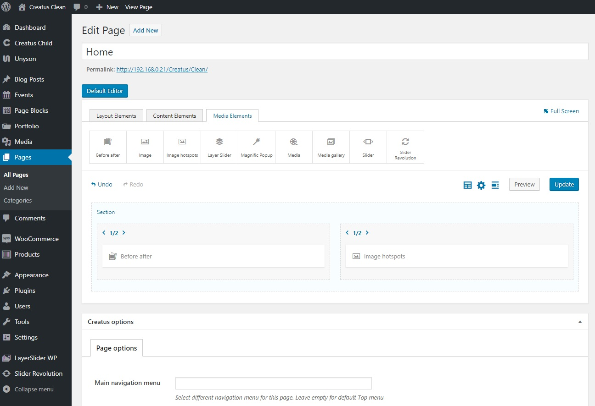

Creatus theme page builder is an enhanced version of __[Unsyon page builder extension](http://manual.unyson.io/en/latest/extension/builder/)__ and comes with 48 custom built page builder elements that are separated in to 3 tabs;

### Layout elements
1. __[Section](https://themezly.com/docs/section/)__ &nbsp;-&nbsp; Main layout building block used to separate columns in to rows.
2. __[Column](https://themezly.com/docs/column/)__ &nbsp;-&nbsp; Main wrapper used to position elements within the row.
3. __[Inner column](https://themezly.com/docs/inner-column/)__ &nbsp;-&nbsp; Same as column with the ability to be placed inside a column.
3. __[Sections slider](https://themezly.com/docs/sections-slider/)__ &nbsp;-&nbsp; This is a slider that can take any section with all it's elements and turn it in to a slide. 

### Content elements

1. __ [Accordion](https://themezly.com/docs/accordion/) __ &nbsp;-&nbsp; Display custom content within collapsible container. 
1. __ [Button](https://themezly.com/docs/button/) __ &nbsp;-&nbsp; A button generator shortcode.
1. __ [Calendar](https://themezly.com/docs/calendar/) __ &nbsp;-&nbsp; Display your tasks or event as a monthly, weekly or daily calendar.
1. __ [Call to action](https://themezly.com/docs/call-to-action/) __ &nbsp;-&nbsp; Display custom content intended to induce visitors attention. 
1. __ [Circle progress](https://themezly.com/docs/circle-progress/) __ &nbsp;-&nbsp; Draw an animated circular bar around the text.
1. __ [Code snippet](https://themezly.com/docs/code-snippet/) __ &nbsp;-&nbsp; Display code blocks within styled code container.
1. __ [Contact form](https://themezly.com/docs/contact-form/) __ &nbsp;-&nbsp; Display a contact form for visitor that is automatically sent to your email when visitor submits it.
1. __ [Countdown](https://themezly.com/docs/countdown/) __ &nbsp;-&nbsp; Display a countdown timer to any specific event. 
1. __ [Counter](https://themezly.com/docs/counter/) __ &nbsp;-&nbsp; Display a animated numbers counter. 
1. __ [Divider](https://themezly.com/docs/divider/) __ &nbsp;-&nbsp; Use divider to make a separation between page builder elements.
1. __ [Dot navigation](https://themezly.com/docs/dot-navigation/) __ &nbsp;-&nbsp; Create dots navigation that auto scrolls to an element when clicked on.
1. __ [Exit popup](https://themezly.com/docs/exit-popup/) __ &nbsp;-&nbsp; Display a popup message when visitor tries to navigate away from your page. 
1. __ [Icon](https://themezly.com/docs/icon/) __ &nbsp;-&nbsp; Select and display any icon from over 3500+ theme icons.
1. __ [Icon box](https://themezly.com/docs/icon-box/) __ &nbsp;-&nbsp; Display custom content with icon within styled content box. 
1. __ [Items grid](https://themezly.com/docs/items-grid/) __ &nbsp;-&nbsp; Display a grid of customizable div content wrappers. 
1. __ [List](https://themezly.com/docs/list/) __ &nbsp;-&nbsp; Display a list of items within ordered, unordered or icon html list. 
1. __ [Map](https://themezly.com/docs/map/) __ &nbsp;-&nbsp; Display customizable Google Maps within a adjustable container. 
1. __ [Menu anchor](https://themezly.com/docs/menu-anchor/) __ &nbsp;-&nbsp; Activate animate scroll to action to this element when a link is clicked. 
1. __ [Notification](https://themezly.com/docs/notification/) __ &nbsp;-&nbsp; Display stylish customized message to your website vistiors.
1. __ [Parse shortcode](https://themezly.com/docs/parse-shortcodes/) __ &nbsp;-&nbsp; Parse any WordPress shortcode withing customizable container. 
1. __ [Parse page](https://themezly.com/docs/parse-page/) __ &nbsp;-&nbsp; Parse external or internal page content, cache it's contents and display it within customizable container. 
1. __ [Posts](https://themezly.com/docs/posts/) __ &nbsp;-&nbsp; Display loop of post items as a grid, timeline or a slider. 
1. __ [Progress bars](https://themezly.com/docs/progress-bars/) __ &nbsp;-&nbsp; Display  visualized  progression of an text defined operation or task.
1. __ [Search form](https://themezly.com/docs/search-form/) __ &nbsp;-&nbsp; Display live or static search form for your website visitors. 
1. __ [Sections menu](https://themezly.com/docs/sections-menu/) __ &nbsp;-&nbsp; Auto create dots sections menu that auto scrolls to a section when clicked on.
1. __ [Sharing links](https://themezly.com/docs/sharing-links/) __ &nbsp;-&nbsp; Display a customizable container with social sharing links.
1. __ [Simple slider](https://themezly.com/docs/simple-slider/) __ &nbsp;-&nbsp; Display a customizable content slider.
1. __ [Social links](https://themezly.com/docs/social-links/) __ &nbsp;-&nbsp; Display a customizable  container with links to your social profiles.
1. __ [Special heading](https://themezly.com/docs/special-heading/) __ &nbsp;-&nbsp; Display custom styled heading with additional sub text block. 
1. __ [Table](https://themezly.com/docs/table/) __ &nbsp;-&nbsp; Display list of tabular data or a pricing table.
1. __ [Tabs](https://themezly.com/docs/tabs/) __ &nbsp;-&nbsp; Display custom content within tab like containers. 
1. __ [Team members](https://themezly.com/docs/team-members/) __ &nbsp;-&nbsp; Display team members with their image, description and social profile links as a grid or slider layout.
1. __ [Testimonials](https://themezly.com/docs/testimonials/) __ &nbsp;-&nbsp; Display adjustable testimonials slider. 
1. __ [Text block](https://themezly.com/docs/text-block/) __ &nbsp;-&nbsp; Display text block within customizable container. 
1. __ [Twitter feed](https://themezly.com/docs/twitter-feed/) __ &nbsp;-&nbsp; Display Twitter user feed as a grid or slider. 
1. __ [Typist](https://themezly.com/docs/typist/) __ &nbsp;-&nbsp; Display typewriter text animation. 
1. __ [Widget area](https://themezly.com/docs/widget-area/) __ &nbsp;-&nbsp; Display any WordPress widget area within customizable container. 

### Media elements

1. __ [Before after](https://themezly.com/docs/before-after/) __ &nbsp;-&nbsp; Highlight differences between two images.  
1. __ [Image](https://themezly.com/docs/image/) __ &nbsp;-&nbsp; Display an image within customizable container.
1. __ [Image hotspots](https://themezly.com/docs/image-hotspots/) __ &nbsp;-&nbsp; Create attractive image area hotspots  with custom tooltips.
1. __ [LayerSlider](https://themezly.com/docs/layer-slider/) __ &nbsp;-&nbsp; Display WordPress LayerSlider. 
1. __ [Magnific popup](https://themezly.com/docs/magnific-popup/) __ &nbsp;-&nbsp; Display images, videos or iframe in attractive and customizable lightbox popup.
1. __ [Media](https://themezly.com/docs/media/) __ &nbsp;-&nbsp; Display Vimeo video, Youtube video, Self hosted video or audio, HTML5 video or audio, iframe or embed within customizable container.
1. __ [Media gallery](https://themezly.com/docs/media-gallery/) __ &nbsp;-&nbsp; Display Images, Vimeo video, Youtube video, Self hosted video or audio, HTML5 video or audio, iframe or embed within grid or slider.
1. __ [Slider Revolution](https://themezly.com/docs/slider-revolution/)__ &nbsp;-&nbsp; Display WordPress Slider Revolution slider. 
1. __ [Slider](https://themezly.com/docs/slider/) __ &nbsp;-&nbsp; Display Unyson Slider extension sliders. 

