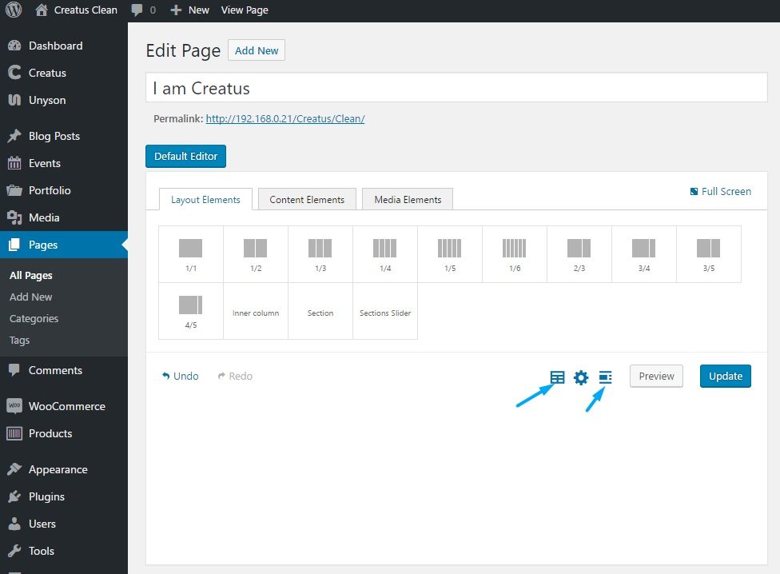
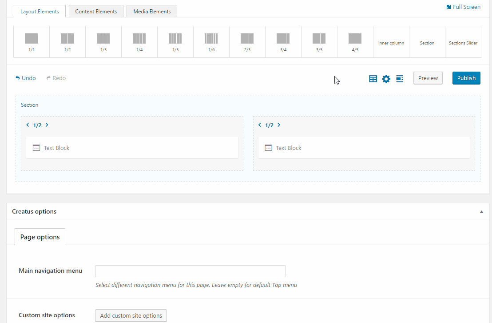
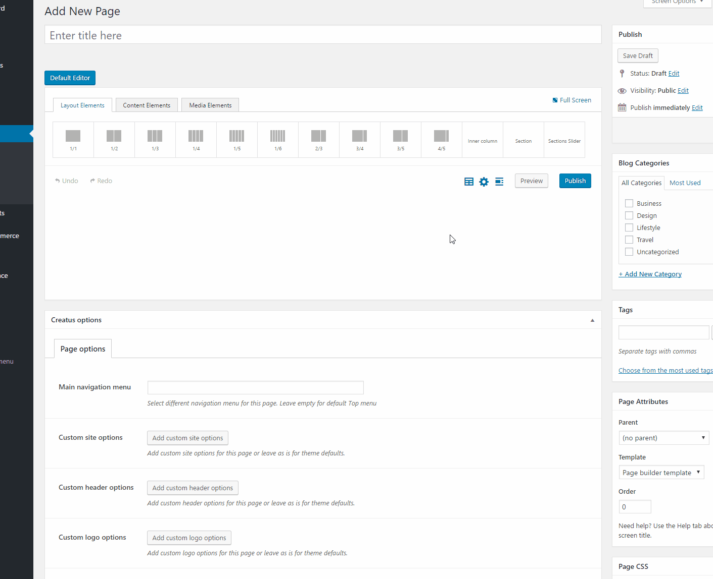

Creatus theme page builder comes with an ability to create __Custom page builder templates__ and a set of __Predefined page builder templates__.

### Custom page builder templates

To create custom template simply locate the section slider, section or column __Save as template__ icon and click on it. Give your template a name and save. Now your template is available under the __Builder templates__ menu and can be accesed on any page that has page builder active.

### Predefined page builder templates

To make things easier for you we have included  __predefined page builder templates__  that populate the page builder with already premade shortocdes. These are self explanatory and in order to use them simply click on desired set and preview your page. 

