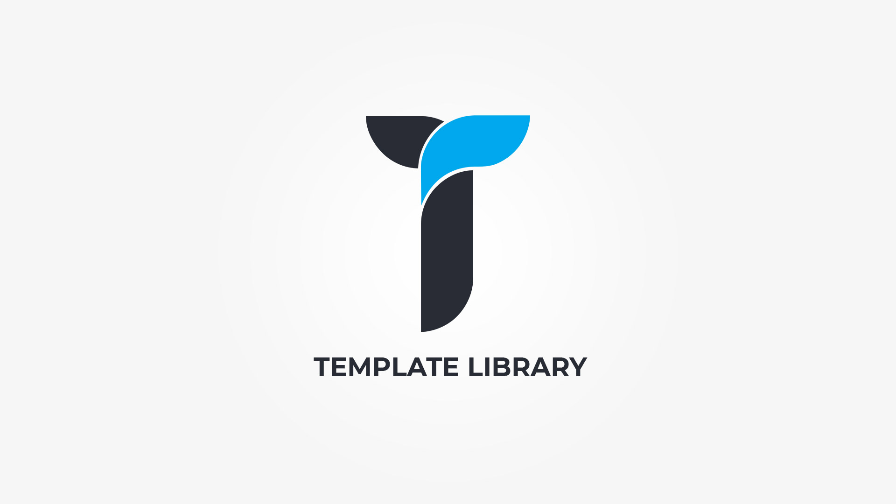

To make things easier for you we have included  __predefined page builder templates__  that populate the page builder with already predefined shortocdes. These are self explanatory and in order to use them simply click on desired item and preview your page. Initial library contains __over 330 templates__ that can be used  on every post edit page where Creatus page builder is present.

### Template Library Categories

1. __ Blog __ &nbsp;-&nbsp; Contains sections with post shortcode combinations.
1. __ Content __ &nbsp;-&nbsp; Contains sections combination of shortcodes that you can use to fill page content.
1. __ Counters __ &nbsp;-&nbsp; Contains sections with counter, countdown or progress bars.
1. __ Call to action __ &nbsp;-&nbsp; Contains sections with text and buttons combinations.
1. __ Features __ &nbsp;-&nbsp; Contains sections text, icon, icon box shortcodes combinations.
1. __ Hero sections __ &nbsp;-&nbsp; Contains premade hero sections.
1. __ Maps __ &nbsp;-&nbsp; Contains sections with map shortcode combinations.
1. __ Pages __ &nbsp;-&nbsp; Contains complete ready to use pages as seen on Creatus demo.
1. __ Pricing __ &nbsp;-&nbsp; Contains combination of sections with pricing tables.
1. __ Team members __ &nbsp;-&nbsp; Contains sections with team members shortcode combinations.
1. __ Testimonials __ &nbsp;-&nbsp; Contains sections with testimonials shortcode combinations.

### How are Pages Category items special

All template categories items __except Page__ category items, when clicked on will simply add a section to the page builder. 
On the other hand Page Category item __completely replaces the page builder content__ and adjusts all required page settings to achieve the selected page look.

### Template Library Demo Images

When you click on a template library item all it's settings are imported in to the page builder. If item contains images, these are than severed from __our resources server__. __We strongly advise you to change the demo images before publishing your page__.